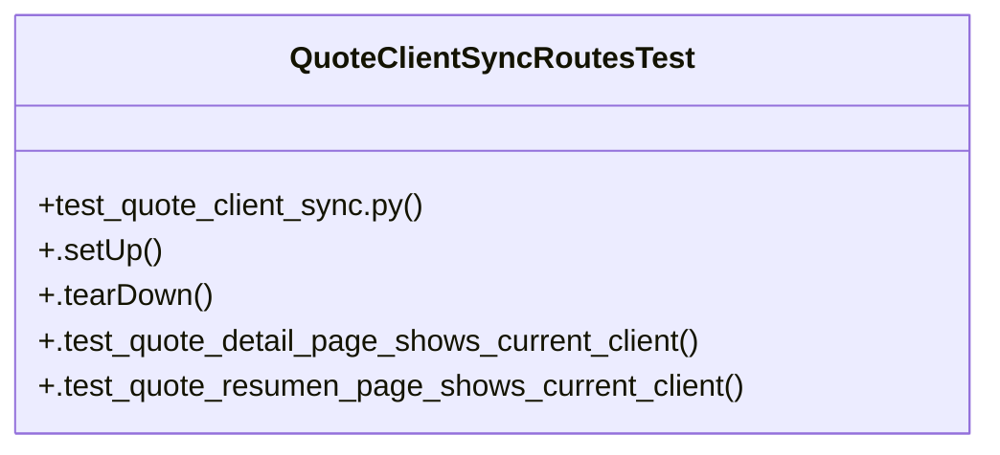

# Community 37

> 6 nodes · cohesion 0.33

## Key Concepts

- [QuoteClientSyncRoutesTest](file:///Users/macbook/ProjectTracker/tests/test_quote_client_sync.py#L82) (5 connections)
- [test_quote_client_sync.py](file:///Users/macbook/ProjectTracker/tests/test_quote_client_sync.py#L1) (3 connections)
- [.tearDown()](file:///Users/macbook/ProjectTracker/tests/test_quote_client_sync.py#L95) (2 connections)
- [.test_quote_detail_page_shows_current_client()](file:///Users/macbook/ProjectTracker/tests/test_quote_client_sync.py#L99) (1 connections)
- [.test_quote_resumen_page_shows_current_client()](file:///Users/macbook/ProjectTracker/tests/test_quote_client_sync.py#L109) (1 connections)
- [El cliente (y el nombre de proyecto) se guardan como snapshot dentro de la cotiz](file:///Users/macbook/ProjectTracker/tests/test_quote_client_sync.py#L1) (1 connections)

## Class Diagram

## Relationships

- No strong cross-community connections detected

## Source Files

- [/Users/macbook/ProjectTracker/tests/test_quote_client_sync.py](file:///Users/macbook/ProjectTracker/tests/test_quote_client_sync.py)

## Audit Trail

- EXTRACTED: 12 (92%)
- INFERRED: 1 (8%)
- AMBIGUOUS: 0 (0%)

---

*Part of the graphify knowledge wiki. See [[index]] to navigate.*