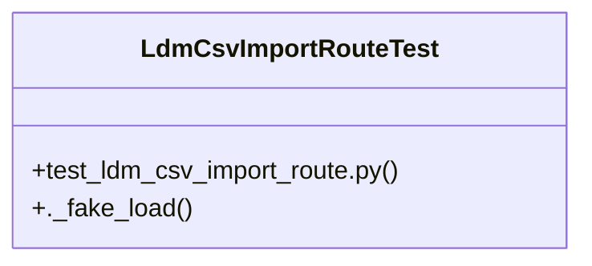

# Community 38

> 4 nodes · cohesion 0.50

## Key Concepts

- [LdmCsvImportRouteTest](file:///Users/macbook/ProjectTracker/tests/test_ldm_csv_import_route.py#L14) (2 connections)
- [test_ldm_csv_import_route.py](file:///Users/macbook/ProjectTracker/tests/test_ldm_csv_import_route.py#L1) (2 connections)
- [._fake_load()](file:///Users/macbook/ProjectTracker/tests/test_ldm_csv_import_route.py#L24) (1 connections)
- [setUpClass()](file:///Users/macbook/ProjectTracker/tests/test_ldm_csv_import_route.py#L16) (1 connections)

## Class Diagram

## Relationships

- No strong cross-community connections detected

## Source Files

- [/Users/macbook/ProjectTracker/tests/test_ldm_csv_import_route.py](file:///Users/macbook/ProjectTracker/tests/test_ldm_csv_import_route.py)

## Audit Trail

- EXTRACTED: 6 (100%)
- INFERRED: 0 (0%)
- AMBIGUOUS: 0 (0%)

---

*Part of the graphify knowledge wiki. See [[index]] to navigate.*