# Community 4

> 68 nodes · cohesion 0.05

## Key Concepts

- [services.py](file:///Users/macbook/ProjectTracker/tracker/services.py#L1) (20 connections)
- [upsert_mobile_draft()](file:///Users/macbook/ProjectTracker/tracker/services.py#L49) (15 connections)
- [UpsertMobileDraftTest](file:///Users/macbook/ProjectTracker/tests/test_services_mobile.py#L81) (12 connections)
- [IdFactory](file:///Users/macbook/ProjectTracker/tests/test_services.py#L12) (10 connections)
- [._upsert()](file:///Users/macbook/ProjectTracker/tests/test_services_mobile.py#L82) (10 connections)
- [ProjectServicesTest](file:///Users/macbook/ProjectTracker/tests/test_services.py#L21) (10 connections)
- [apply_task_status_change()](file:///Users/macbook/ProjectTracker/tracker/services.py#L263) (9 connections)
- [filter_catalog_by_disciplina()](file:///Users/macbook/ProjectTracker/tracker/services.py#L9) (8 connections)
- [finalize_mobile_draft()](file:///Users/macbook/ProjectTracker/tracker/services.py#L123) (8 connections)
- [remove_item_from_draft()](file:///Users/macbook/ProjectTracker/tracker/services.py#L101) (8 connections)
- [FilterCatalogTest](file:///Users/macbook/ProjectTracker/tests/test_services_mobile.py#L59) (6 connections)
- [RemoveItemFromDraftTest](file:///Users/macbook/ProjectTracker/tests/test_services_mobile.py#L161) (6 connections)
- [build_scope_task()](file:///Users/macbook/ProjectTracker/tracker/services.py#L166) (5 connections)
- [create_project_with_tasks()](file:///Users/macbook/ProjectTracker/tracker/services.py#L184) (5 connections)
- [test_services_mobile.py](file:///Users/macbook/ProjectTracker/tests/test_services_mobile.py#L1) (5 connections)
- [_recalculate_totals()](file:///Users/macbook/ProjectTracker/tracker/services.py#L40) (4 connections)
- [sync_project_alcances()](file:///Users/macbook/ProjectTracker/tracker/services.py#L209) (4 connections)
- [update_observation_details()](file:///Users/macbook/ProjectTracker/tracker/services.py#L324) (4 connections)
- [FinalizeMobileDraftTest](file:///Users/macbook/ProjectTracker/tests/test_services_mobile.py#L192) (4 connections)
- [._setup()](file:///Users/macbook/ProjectTracker/tests/test_services_mobile.py#L162) (4 connections)
- [_build_mobile_item()](file:///Users/macbook/ProjectTracker/tracker/services.py#L16) (3 connections)
- [next_folder_number()](file:///Users/macbook/ProjectTracker/tracker/services.py#L145) (3 connections)
- [update_observation_checklist_item()](file:///Users/macbook/ProjectTracker/tracker/services.py#L357) (3 connections)
- [.test_finalize_assigns_quote_number()](file:///Users/macbook/ProjectTracker/tests/test_services_mobile.py#L201) (3 connections)
- [.test_finalize_removes_status_field()](file:///Users/macbook/ProjectTracker/tests/test_services_mobile.py#L193) (3 connections)
- *... and 43 more nodes in this community*

## Class Diagram

```mermaid
classDiagram
    class IdFactory {
        +test_services.py()
        +.__init__()
        +.__call__()
    }
    class FilterCatalogTest {
        +test_services_mobile.py()
        +.test_none_returns_all()
        +.test_todos_returns_all()
        +.test_filters_by_disciplina()
        +.test_unknown_disciplina_returns_empty()
        +.test_empty_catalog()
    }
    class FinalizeMobileDraftTest {
        +test_services_mobile.py()
        +.test_finalize_removes_status_field()
        +.test_finalize_assigns_quote_number()
        +.test_finalize_returns_none_for_unknown_id()
    }
    class IdFactory {
        +test_services_mobile.py()
        +.__init__()
        +.__call__()
    }
    class RemoveItemFromDraftTest {
        +test_services_mobile.py()
        +._setup()
        +.test_removes_item_and_recalculates()
        +.test_no_op_when_item_not_in_draft()
        +.test_returns_none_when_no_draft_exists()
        +.test_empty_items_after_last_removal()
    }
    class UpsertMobileDraftTest {
        +test_services_mobile.py()
        +._upsert()
        +.test_creates_draft_when_none_exists()
        +.test_item_fields_populated_from_catalog()
        +.test_totals_calculated()
        +.test_second_item_appended_to_existing_draft()
        +.test_re_adding_same_item_updates_qty()
        +.test_unknown_item_id_is_no_op()
        +.test_draft_defaults()
        +.test_original_quotes_list_not_mutated()
    }
    class ProjectServicesTest {
        +test_services.py()
        +.test_create_project_assigns_next_folder_and_tasks()
        +.test_sync_project_alcances_adds_and_removes_tasks_with_children()
        +.test_apply_task_status_blocks_dependency()
        +.test_apply_task_status_creates_observation_child()
        +.test_apply_task_status_creates_observation_checklist()
        +.test_apply_task_status_does_not_generate_checklist_from_note()
        +.test_apply_task_status_creates_new_observation_when_already_in_observations()
        +.test_update_observation_details_edits_note_and_checklist()
        +.test_update_observation_checklist_item_updates_status()
    }
```

## Relationships

- No strong cross-community connections detected

## Source Files

- [/Users/macbook/ProjectTracker/tests/test_services.py](file:///Users/macbook/ProjectTracker/tests/test_services.py)
- [/Users/macbook/ProjectTracker/tests/test_services_mobile.py](file:///Users/macbook/ProjectTracker/tests/test_services_mobile.py)
- [/Users/macbook/ProjectTracker/tracker/services.py](file:///Users/macbook/ProjectTracker/tracker/services.py)

## Audit Trail

- EXTRACTED: 186 (72%)
- INFERRED: 74 (28%)
- AMBIGUOUS: 0 (0%)

---

*Part of the graphify knowledge wiki. See [[index]] to navigate.*