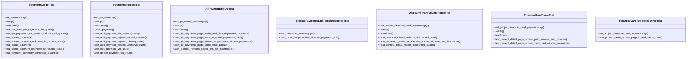

# Community 4

> 74 nodes · cohesion 0.04

## Key Concepts

- [add_payment()](file:///Users/macbook/ProjectTracker/tracker/payments.py#L76) (16 connections)
- [payments.py](file:///Users/macbook/ProjectTracker/tracker/payments.py#L1) (14 connections)
- [PaymentsRoutesTest](file:///Users/macbook/ProjectTracker/tests/test_payments.py#L109) (13 connections)
- [PaymentsModelTest](file:///Users/macbook/ProjectTracker/tests/test_payments.py#L52) (12 connections)
- [get_payments()](file:///Users/macbook/ProjectTracker/tracker/payments.py#L33) (9 connections)
- [get_payments_for_quote()](file:///Users/macbook/ProjectTracker/tracker/payments.py#L48) (9 connections)
- [get_payment_by_id()](file:///Users/macbook/ProjectTracker/tracker/payments.py#L113) (8 connections)
- [._add_payment()](file:///Users/macbook/ProjectTracker/tests/test_payments.py#L131) (8 connections)
- [AllPaymentsRouteTest](file:///Users/macbook/ProjectTracker/tests/test_payments_summary.py#L55) (8 connections)
- [DiscountFinancialCardRouteTest](file:///Users/macbook/ProjectTracker/tests/test_project_financial_card_payments.py#L134) (7 connections)
- [delete_payment()](file:///Users/macbook/ProjectTracker/tracker/payments.py#L104) (6 connections)
- [_normalize_payment()](file:///Users/macbook/ProjectTracker/tracker/payments.py#L11) (6 connections)
- [payment_summary()](file:///Users/macbook/ProjectTracker/tracker/payments.py#L66) (6 connections)
- [update_payment()](file:///Users/macbook/ProjectTracker/tracker/payments.py#L92) (6 connections)
- [get_payments_for_project()](file:///Users/macbook/ProjectTracker/tracker/payments.py#L57) (5 connections)
- [save_payments()](file:///Users/macbook/ProjectTracker/tracker/payments.py#L43) (5 connections)
- [FinancialCardRouteTest](file:///Users/macbook/ProjectTracker/tests/test_project_financial_card_payments.py#L58) (5 connections)
- [add_payment_route()](file:///Users/macbook/ProjectTracker/tracker/routes/quotes.py#L417) (4 connections)
- [all_payments()](file:///Users/macbook/ProjectTracker/tracker/routes/quotes.py#L1031) (4 connections)
- [_clean_payment_form()](file:///Users/macbook/ProjectTracker/tracker/routes/quotes.py#L398) (4 connections)
- [edit_payment_route()](file:///Users/macbook/ProjectTracker/tracker/routes/quotes.py#L435) (4 connections)
- [.test_delete_payment()](file:///Users/macbook/ProjectTracker/tests/test_payments.py#L88) (4 connections)
- [.test_update_payment()](file:///Users/macbook/ProjectTracker/tests/test_payments.py#L76) (4 connections)
- [.test_delete_payment_via_route()](file:///Users/macbook/ProjectTracker/tests/test_payments.py#L182) (4 connections)
- [.test_edit_payment_via_route()](file:///Users/macbook/ProjectTracker/tests/test_payments.py#L169) (4 connections)
- *... and 49 more nodes in this community*

## Class Diagram

```mermaid
classDiagram
    class PaymentsModelTest {
        +test_payments.py()
        +.setUp()
        +.tearDown()
        +.test_add_and_get_payments_for_quote()
        +.test_get_payments_for_project_includes_all_quotes()
        +.test_update_payment()
        +.test_update_payment_unknown_id_returns_false()
        +.test_delete_payment()
        +.test_delete_payment_unknown_id_returns_false()
        +.test_payment_summary_computes_balance()
    }
    class PaymentsRoutesTest {
        +test_payments.py()
        +.setUp()
        +.tearDown()
        +._add_payment()
        +.test_add_payment_via_project_route()
        +.test_add_payment_rejects_invalid_amount()
        +.test_add_payment_rejects_missing_date()
        +.test_add_payment_rejects_unknown_quote()
        +.test_edit_payment_via_route()
        +.test_delete_payment_via_route()
    }
    class AllPaymentsRouteTest {
        +test_payments_summary.py()
        +.setUp()
        +.tearDown()
        +.test_all_payments_page_loads_and_lists_registered_payment()
        +.test_all_payments_page_links_to_quote_payments_card()
        +.test_all_payments_page_shows_empty_state_without_payments()
        +.test_all_payments_page_sums_total_pagado()
        +.test_sidebar_renders_pagos_link_on_dashboard()
    }
    class SidebarPaymentsLinkTemplateSourceTest {
        +test_payments_summary.py()
        +.test_base_template_has_sidebar_payments_link()
    }
    class DiscountFinancialCardRouteTest {
        +test_project_financial_card_payments.py()
        +.setUp()
        +.tearDown()
        +.test_cotizado_cliente_reflects_discounted_total()
        +.test_pagado_y_saldo_se_calculan_contra_el_total_con_descuento()
        +.test_context_totals_match_discounted_quote()
    }
    class FinancialCardRouteTest {
        +test_project_financial_card_payments.py()
        +.setUp()
        +.tearDown()
        +.test_project_detail_page_shows_paid_amount_and_balance()
        +.test_project_detail_page_shows_zero_paid_without_payments()
    }
    class FinancialCardTemplateSourceTest {
        +test_project_financial_card_payments.py()
        +.test_project_detail_shows_pagado_and_saldo_rows()
    }
```

## Relationships

- [[Community 5]] (10 shared connections)

## Source Files

- [/Users/macbook/ProjectTracker/tests/test_payments.py](file:///Users/macbook/ProjectTracker/tests/test_payments.py)
- [/Users/macbook/ProjectTracker/tests/test_payments_summary.py](file:///Users/macbook/ProjectTracker/tests/test_payments_summary.py)
- [/Users/macbook/ProjectTracker/tests/test_project_financial_card_payments.py](file:///Users/macbook/ProjectTracker/tests/test_project_financial_card_payments.py)
- [/Users/macbook/ProjectTracker/tracker/payments.py](file:///Users/macbook/ProjectTracker/tracker/payments.py)
- [/Users/macbook/ProjectTracker/tracker/routes/quotes.py](file:///Users/macbook/ProjectTracker/tracker/routes/quotes.py)

## Audit Trail

- EXTRACTED: 181 (66%)
- INFERRED: 93 (34%)
- AMBIGUOUS: 0 (0%)

---

*Part of the graphify knowledge wiki. See [[index]] to navigate.*