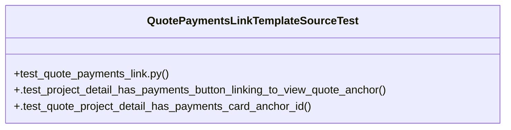

# Community 41

> 5 nodes · cohesion 0.40

## Key Concepts

- [QuotePaymentsLinkTemplateSourceTest](file:///Users/macbook/ProjectTracker/tests/test_quote_payments_link.py#L50) (3 connections)
- [test_quote_payments_link.py](file:///Users/macbook/ProjectTracker/tests/test_quote_payments_link.py#L1) (3 connections)
- [.test_project_detail_has_payments_button_linking_to_view_quote_anchor()](file:///Users/macbook/ProjectTracker/tests/test_quote_payments_link.py#L51) (1 connections)
- [.test_quote_project_detail_has_payments_card_anchor_id()](file:///Users/macbook/ProjectTracker/tests/test_quote_payments_link.py#L59) (1 connections)
- [Botón "Pagos" en la fila de cada cotización (lista de cotizaciones, project_deta](file:///Users/macbook/ProjectTracker/tests/test_quote_payments_link.py#L1) (1 connections)

## Class Diagram

## Relationships

- No strong cross-community connections detected

## Source Files

- [/Users/macbook/ProjectTracker/tests/test_quote_payments_link.py](file:///Users/macbook/ProjectTracker/tests/test_quote_payments_link.py)

## Audit Trail

- EXTRACTED: 9 (100%)
- INFERRED: 0 (0%)
- AMBIGUOUS: 0 (0%)

---

*Part of the graphify knowledge wiki. See [[index]] to navigate.*