# Community 5

> 66 nodes · cohesion 0.07

## Key Concepts

- [compute_consistency()](file:///Users/macbook/ProjectTracker/tracker/consistency.py#L408) (24 connections)
- [consistency.py](file:///Users/macbook/ProjectTracker/tracker/consistency.py#L1) (24 connections)
- [_quote()](file:///Users/macbook/ProjectTracker/tests/test_consistency.py#L19) (14 connections)
- [pick_active_quote()](file:///Users/macbook/ProjectTracker/tracker/consistency.py#L52) (12 connections)
- [test_consistency.py](file:///Users/macbook/ProjectTracker/tests/test_consistency.py#L1) (11 connections)
- [is_base_quote_type()](file:///Users/macbook/ProjectTracker/tracker/catalog.py#L80) (10 connections)
- [aggregate_quote_items()](file:///Users/macbook/ProjectTracker/tracker/consistency.py#L79) (10 connections)
- [_q_item()](file:///Users/macbook/ProjectTracker/tests/test_consistency.py#L35) (10 connections)
- [compare_items()](file:///Users/macbook/ProjectTracker/tracker/consistency.py#L216) (9 connections)
- [ComputeConsistencyTest](file:///Users/macbook/ProjectTracker/tests/test_consistency.py#L193) (9 connections)
- [_round()](file:///Users/macbook/ProjectTracker/tracker/consistency.py#L37) (8 connections)
- [.test_detects_all_issue_types()](file:///Users/macbook/ProjectTracker/tests/test_consistency.py#L151) (8 connections)
- [aggregate_ldm_items()](file:///Users/macbook/ProjectTracker/tracker/consistency.py#L120) (7 connections)
- [_safe_float()](file:///Users/macbook/ProjectTracker/tracker/consistency.py#L30) (7 connections)
- [.test_critical_when_ldm_exceeds_cot()](file:///Users/macbook/ProjectTracker/tests/test_consistency.py#L231) (6 connections)
- [.test_full_report_with_general_quote()](file:///Users/macbook/ProjectTracker/tests/test_consistency.py#L194) (6 connections)
- [.test_warning_threshold()](file:///Users/macbook/ProjectTracker/tests/test_consistency.py#L222) (6 connections)
- [_l_item()](file:///Users/macbook/ProjectTracker/tests/test_consistency.py#L58) (6 connections)
- [_ldm()](file:///Users/macbook/ProjectTracker/tests/test_consistency.py#L46) (6 connections)
- [PickActiveQuoteTest](file:///Users/macbook/ProjectTracker/tests/test_consistency.py#L80) (6 connections)
- [_quote_visual_row()](file:///Users/macbook/ProjectTracker/tracker/consistency.py#L316) (5 connections)
- [classify_margin()](file:///Users/macbook/ProjectTracker/tracker/consistency.py#L41) (4 connections)
- [_ldm_visual_row()](file:///Users/macbook/ProjectTracker/tracker/consistency.py#L331) (4 connections)
- [.test_aggregates_across_multiple_ldms()](file:///Users/macbook/ProjectTracker/tests/test_consistency.py#L137) (4 connections)
- [.test_groups_by_catalog_id_and_handles_unlinked()](file:///Users/macbook/ProjectTracker/tests/test_consistency.py#L115) (4 connections)
- *... and 41 more nodes in this community*

## Class Diagram

```mermaid
classDiagram
    class AggregateLdmItemsTest {
        +test_consistency.py()
        +.test_aggregates_across_multiple_ldms()
    }
    class AggregateQuoteItemsTest {
        +test_consistency.py()
        +.test_groups_by_catalog_id_and_handles_unlinked()
        +.test_no_quote()
    }
    class ClassifyMarginTest {
        +test_consistency.py()
        +.test_thresholds()
    }
    class CompareItemsTest {
        +test_consistency.py()
        +.test_detects_all_issue_types()
    }
    class ComputeConsistencyTest {
        +test_consistency.py()
        +.test_full_report_with_general_quote()
        +.test_warning_threshold()
        +.test_critical_when_ldm_exceeds_cot()
        +.test_no_data_when_empty()
        +.test_no_general_quote_uses_fallback()
        +.test_filters_by_project_id()
        +.test_visual_warnings_include_missing_data_and_unlinked_rows()
        +.test_active_extras_are_included_in_visual_total()
    }
    class PickActiveQuoteTest {
        +test_consistency.py()
        +.test_picks_most_recent_general()
        +.test_falls_back_to_preliminar_when_no_general()
        +.test_respects_approval_status_active()
        +.test_extraordinaria_never_selected_as_base()
        +.test_no_quotes()
    }
```

## Relationships

- No strong cross-community connections detected

## Source Files

- [/Users/macbook/ProjectTracker/tests/test_consistency.py](file:///Users/macbook/ProjectTracker/tests/test_consistency.py)
- [/Users/macbook/ProjectTracker/tracker/catalog.py](file:///Users/macbook/ProjectTracker/tracker/catalog.py)
- [/Users/macbook/ProjectTracker/tracker/consistency.py](file:///Users/macbook/ProjectTracker/tracker/consistency.py)
- [/Users/macbook/ProjectTracker/tracker/routes/quotes.py](file:///Users/macbook/ProjectTracker/tracker/routes/quotes.py)

## Audit Trail

- EXTRACTED: 249 (81%)
- INFERRED: 60 (19%)
- AMBIGUOUS: 0 (0%)

---

*Part of the graphify knowledge wiki. See [[index]] to navigate.*