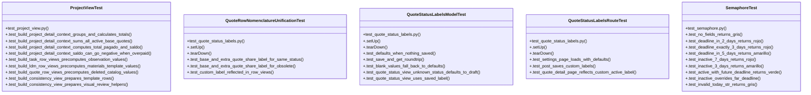

# Community 5

> 78 nodes · cohesion 0.04

## Key Concepts

- [build_project_detail_context()](file:///Users/macbook/Documents/ProjectTracker/tracker/project_view.py#L153) (24 connections)
- [domain.py](file:///Users/macbook/Documents/ProjectTracker/tracker/domain.py#L1) (20 connections)
- [project_view.py](file:///Users/macbook/Documents/ProjectTracker/tracker/project_view.py#L1) (18 connections)
- [project_semaphore()](file:///Users/macbook/Documents/ProjectTracker/tracker/domain.py#L145) (14 connections)
- [SemaphoreTest](file:///Users/macbook/Documents/ProjectTracker/tests/test_semaphore.py#L8) (12 connections)
- [ProjectViewTest](file:///Users/macbook/Documents/ProjectTracker/tests/test_project_view.py#L13) (10 connections)
- [build_quote_row_views()](file:///Users/macbook/Documents/ProjectTracker/tracker/project_view.py#L64) (9 connections)
- [get_quote_status_labels()](file:///Users/macbook/Documents/ProjectTracker/tracker/quote_status_labels.py#L33) (9 connections)
- [quote_status_view()](file:///Users/macbook/Documents/ProjectTracker/tracker/quote_status_labels.py#L56) (9 connections)
- [QuoteStatusLabelsModelTest](file:///Users/macbook/Documents/ProjectTracker/tests/test_quote_status_labels.py#L47) (8 connections)
- [build_consistency_view()](file:///Users/macbook/Documents/ProjectTracker/tracker/project_view.py#L124) (7 connections)
- [save_quote_status_labels()](file:///Users/macbook/Documents/ProjectTracker/tracker/quote_status_labels.py#L48) (7 connections)
- [QuoteRowNomenclatureUnificationTest](file:///Users/macbook/Documents/ProjectTracker/tests/test_quote_status_labels.py#L85) (7 connections)
- [quote_status_labels.py](file:///Users/macbook/Documents/ProjectTracker/tracker/quote_status_labels.py#L1) (7 connections)
- [QuoteStatusLabelsRouteTest](file:///Users/macbook/Documents/ProjectTracker/tests/test_quote_status_labels.py#L121) (6 connections)
- [get_alcances()](file:///Users/macbook/Documents/ProjectTracker/tracker/domain.py#L24) (5 connections)
- [quote_status_labels_admin()](file:///Users/macbook/Documents/ProjectTracker/tracker/routes/quotes.py#L970) (5 connections)
- [check_blocked()](file:///Users/macbook/Documents/ProjectTracker/tracker/domain.py#L66) (4 connections)
- [get_alcances_by_id()](file:///Users/macbook/Documents/ProjectTracker/tracker/domain.py#L31) (4 connections)
- [get_progress()](file:///Users/macbook/Documents/ProjectTracker/tracker/domain.py#L98) (4 connections)
- [build_ldm_row_views()](file:///Users/macbook/Documents/ProjectTracker/tracker/project_view.py#L49) (4 connections)
- [build_task_row_views()](file:///Users/macbook/Documents/ProjectTracker/tracker/project_view.py#L104) (4 connections)
- [all_quotes()](file:///Users/macbook/Documents/ProjectTracker/tracker/routes/quotes.py#L989) (4 connections)
- [_deleted_catalog_items()](file:///Users/macbook/Documents/ProjectTracker/tracker/project_view.py#L33) (3 connections)
- [.test_custom_label_reflected_in_row_views()](file:///Users/macbook/Documents/ProjectTracker/tests/test_quote_status_labels.py#L113) (3 connections)
- *... and 53 more nodes in this community*

## Class Diagram

```mermaid
classDiagram
    class ProjectViewTest {
        +test_project_view.py()
        +.test_build_project_detail_context_groups_and_calculates_totals()
        +.test_build_project_detail_context_sums_all_active_base_quotes()
        +.test_build_project_detail_context_computes_total_pagado_and_saldo()
        +.test_build_project_detail_context_saldo_can_go_negative_when_overpaid()
        +.test_build_task_row_views_precomputes_observation_values()
        +.test_build_ldm_row_views_precomputes_materials_template_values()
        +.test_build_quote_row_views_precomputes_deleted_catalog_values()
        +.test_build_consistency_view_prepares_template_rows()
        +.test_build_consistency_view_prepares_visual_review_helpers()
    }
    class QuoteRowNomenclatureUnificationTest {
        +test_quote_status_labels.py()
        +.setUp()
        +.tearDown()
        +.test_base_and_extra_quote_share_label_for_same_status()
        +.test_base_and_extra_quote_share_label_for_obsolete()
        +.test_custom_label_reflected_in_row_views()
    }
    class QuoteStatusLabelsModelTest {
        +test_quote_status_labels.py()
        +.setUp()
        +.tearDown()
        +.test_defaults_when_nothing_saved()
        +.test_save_and_get_roundtrip()
        +.test_blank_values_fall_back_to_defaults()
        +.test_quote_status_view_unknown_status_defaults_to_draft()
        +.test_quote_status_view_uses_saved_label()
    }
    class QuoteStatusLabelsRouteTest {
        +test_quote_status_labels.py()
        +.setUp()
        +.tearDown()
        +.test_settings_page_loads_with_defaults()
        +.test_post_saves_custom_labels()
        +.test_quote_detail_page_reflects_custom_active_label()
    }
    class SemaphoreTest {
        +test_semaphore.py()
        +.test_no_fields_returns_gris()
        +.test_deadline_in_2_days_returns_rojo()
        +.test_deadline_exactly_3_days_returns_rojo()
        +.test_deadline_in_5_days_returns_amarillo()
        +.test_inactive_7_days_returns_rojo()
        +.test_inactive_3_days_returns_amarillo()
        +.test_active_with_future_deadline_returns_verde()
        +.test_inactive_overrides_far_deadline()
        +.test_invalid_today_str_returns_gris()
    }
```

## Relationships

- [[Community 10]] (4 shared connections)
- [[Community 0]] (1 shared connections)
- [[Community 24]] (1 shared connections)

## Source Files

- [/Users/macbook/Documents/ProjectTracker/tests/test_project_view.py](file:///Users/macbook/Documents/ProjectTracker/tests/test_project_view.py)
- [/Users/macbook/Documents/ProjectTracker/tests/test_quote_status_labels.py](file:///Users/macbook/Documents/ProjectTracker/tests/test_quote_status_labels.py)
- [/Users/macbook/Documents/ProjectTracker/tests/test_semaphore.py](file:///Users/macbook/Documents/ProjectTracker/tests/test_semaphore.py)
- [/Users/macbook/Documents/ProjectTracker/tracker/domain.py](file:///Users/macbook/Documents/ProjectTracker/tracker/domain.py)
- [/Users/macbook/Documents/ProjectTracker/tracker/project_view.py](file:///Users/macbook/Documents/ProjectTracker/tracker/project_view.py)
- [/Users/macbook/Documents/ProjectTracker/tracker/quote_status_labels.py](file:///Users/macbook/Documents/ProjectTracker/tracker/quote_status_labels.py)
- [/Users/macbook/Documents/ProjectTracker/tracker/routes/admin.py](file:///Users/macbook/Documents/ProjectTracker/tracker/routes/admin.py)
- [/Users/macbook/Documents/ProjectTracker/tracker/routes/quotes.py](file:///Users/macbook/Documents/ProjectTracker/tracker/routes/quotes.py)
- [/Users/macbook/ProjectTracker/tests/test_quote_status_labels.py](file:///Users/macbook/ProjectTracker/tests/test_quote_status_labels.py)
- [/Users/macbook/ProjectTracker/tracker/domain.py](file:///Users/macbook/ProjectTracker/tracker/domain.py)
- [/Users/macbook/ProjectTracker/tracker/quote_status_labels.py](file:///Users/macbook/ProjectTracker/tracker/quote_status_labels.py)

## Audit Trail

- EXTRACTED: 192 (63%)
- INFERRED: 113 (37%)
- AMBIGUOUS: 0 (0%)

---

*Part of the graphify knowledge wiki. See [[index]] to navigate.*