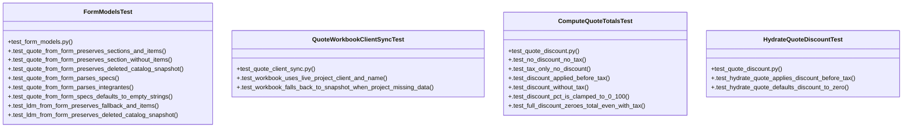

# Community 5

> 78 nodes · cohesion 0.05

## Key Concepts

- [quotes.py](file:///Users/macbook/Documents/ProjectTracker/tracker/routes/quotes.py#L1) (49 connections)
- [catalog_maps()](file:///Users/macbook/Documents/ProjectTracker/tracker/catalog.py#L191) (32 connections)
- [hydrate_quote()](file:///Users/macbook/Documents/ProjectTracker/tracker/catalog.py#L421) (24 connections)
- [quote_type_key()](file:///Users/macbook/Documents/ProjectTracker/tracker/catalog.py#L72) (15 connections)
- [_render_quote_form()](file:///Users/macbook/Documents/ProjectTracker/tracker/routes/quotes.py#L66) (14 connections)
- [compute_quote_totals()](file:///Users/macbook/Documents/ProjectTracker/tracker/catalog.py#L351) (13 connections)
- [_hydrate_quote_for_display()](file:///Users/macbook/Documents/ProjectTracker/tracker/routes/quotes.py#L49) (13 connections)
- [quote_pdf_editor()](file:///Users/macbook/Documents/ProjectTracker/tracker/routes/quotes.py#L1086) (13 connections)
- [quote_from_form()](file:///Users/macbook/Documents/ProjectTracker/tracker/form_models.py#L28) (12 connections)
- [_build_quote_workbook()](file:///Users/macbook/Documents/ProjectTracker/tracker/routes/quotes.py#L590) (12 connections)
- [new_quote()](file:///Users/macbook/Documents/ProjectTracker/tracker/routes/quotes.py#L186) (12 connections)
- [terms_templates_config.py](file:///Users/macbook/Documents/ProjectTracker/tracker/terms_templates_config.py#L1) (12 connections)
- [export_data()](file:///Users/macbook/Documents/ProjectTracker/tracker/routes/admin.py#L954) (10 connections)
- [_build_resumen()](file:///Users/macbook/Documents/ProjectTracker/tracker/routes/quotes.py#L172) (10 connections)
- [edit_quote()](file:///Users/macbook/Documents/ProjectTracker/tracker/routes/quotes.py#L318) (10 connections)
- [view_quote()](file:///Users/macbook/Documents/ProjectTracker/tracker/routes/quotes.py#L376) (10 connections)
- [import_quote_csv()](file:///Users/macbook/Documents/ProjectTracker/tracker/routes/quotes.py#L257) (9 connections)
- [FormModelsTest](file:///Users/macbook/Documents/ProjectTracker/tests/test_form_models.py#L8) (9 connections)
- [_quote_preview_from_csv()](file:///Users/macbook/Documents/ProjectTracker/tracker/routes/quotes.py#L135) (8 connections)
- [resolve_quote_terms()](file:///Users/macbook/Documents/ProjectTracker/tracker/terms_templates_config.py#L96) (8 connections)
- [_fill_bundle_snapshots()](file:///Users/macbook/Documents/ProjectTracker/tracker/routes/quotes.py#L55) (7 connections)
- [purge_deleted_item()](file:///Users/macbook/Documents/ProjectTracker/tracker/routes/quotes.py#L800) (7 connections)
- [purge_quote_deleted_catalog_items()](file:///Users/macbook/Documents/ProjectTracker/tracker/routes/quotes.py#L515) (7 connections)
- [get_terms_templates()](file:///Users/macbook/Documents/ProjectTracker/tracker/terms_templates_config.py#L74) (7 connections)
- [ComputeQuoteTotalsTest](file:///Users/macbook/Documents/ProjectTracker/tests/test_quote_discount.py#L6) (7 connections)
- *... and 53 more nodes in this community*

## Class Diagram

```mermaid
classDiagram
    class FormModelsTest {
        +test_form_models.py()
        +.test_quote_from_form_preserves_sections_and_items()
        +.test_quote_from_form_preserves_section_without_items()
        +.test_quote_from_form_preserves_deleted_catalog_snapshot()
        +.test_quote_from_form_parses_specs()
        +.test_quote_from_form_parses_integrantes()
        +.test_quote_from_form_specs_defaults_to_empty_strings()
        +.test_ldm_from_form_preserves_fallback_and_items()
        +.test_ldm_from_form_preserves_deleted_catalog_snapshot()
    }
    class QuoteWorkbookClientSyncTest {
        +test_quote_client_sync.py()
        +.test_workbook_uses_live_project_client_and_name()
        +.test_workbook_falls_back_to_snapshot_when_project_missing_data()
    }
    class ComputeQuoteTotalsTest {
        +test_quote_discount.py()
        +.test_no_discount_no_tax()
        +.test_tax_only_no_discount()
        +.test_discount_applied_before_tax()
        +.test_discount_without_tax()
        +.test_discount_pct_is_clamped_to_0_100()
        +.test_full_discount_zeroes_total_even_with_tax()
    }
    class HydrateQuoteDiscountTest {
        +test_quote_discount.py()
        +.test_hydrate_quote_applies_discount_before_tax()
        +.test_hydrate_quote_defaults_discount_to_zero()
    }
```

## Relationships

- [[Community 27]] (2 shared connections)
- [[Community 1]] (1 shared connections)
- [[Community 2]] (1 shared connections)

## Source Files

- [/Users/macbook/Documents/ProjectTracker/tests/test_form_models.py](file:///Users/macbook/Documents/ProjectTracker/tests/test_form_models.py)
- [/Users/macbook/Documents/ProjectTracker/tests/test_quote_client_sync.py](file:///Users/macbook/Documents/ProjectTracker/tests/test_quote_client_sync.py)
- [/Users/macbook/Documents/ProjectTracker/tests/test_quote_discount.py](file:///Users/macbook/Documents/ProjectTracker/tests/test_quote_discount.py)
- [/Users/macbook/Documents/ProjectTracker/tracker/catalog.py](file:///Users/macbook/Documents/ProjectTracker/tracker/catalog.py)
- [/Users/macbook/Documents/ProjectTracker/tracker/deletions.py](file:///Users/macbook/Documents/ProjectTracker/tracker/deletions.py)
- [/Users/macbook/Documents/ProjectTracker/tracker/form_models.py](file:///Users/macbook/Documents/ProjectTracker/tracker/form_models.py)
- [/Users/macbook/Documents/ProjectTracker/tracker/routes/admin.py](file:///Users/macbook/Documents/ProjectTracker/tracker/routes/admin.py)
- [/Users/macbook/Documents/ProjectTracker/tracker/routes/quotes.py](file:///Users/macbook/Documents/ProjectTracker/tracker/routes/quotes.py)
- [/Users/macbook/Documents/ProjectTracker/tracker/terms_templates_config.py](file:///Users/macbook/Documents/ProjectTracker/tracker/terms_templates_config.py)
- [/Users/macbook/ProjectTracker/tests/test_quote_client_sync.py](file:///Users/macbook/ProjectTracker/tests/test_quote_client_sync.py)
- [/Users/macbook/ProjectTracker/tracker/deletions.py](file:///Users/macbook/ProjectTracker/tracker/deletions.py)
- [/Users/macbook/ProjectTracker/tracker/terms_templates_config.py](file:///Users/macbook/ProjectTracker/tracker/terms_templates_config.py)

## Audit Trail

- EXTRACTED: 246 (53%)
- INFERRED: 220 (47%)
- AMBIGUOUS: 0 (0%)

---

*Part of the graphify knowledge wiki. See [[index]] to navigate.*