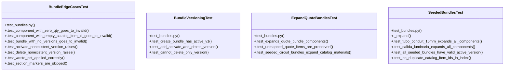

# Community 6

> 51 nodes · cohesion 0.08

## Key Concepts

- [expand_quote_bundles()](file:///Users/macbook/ProjectTracker/tracker/bundles.py#L178) (19 connections)
- [bundles.py](file:///Users/macbook/ProjectTracker/tracker/bundles.py#L1) (17 connections)
- [create_bundle()](file:///Users/macbook/ProjectTracker/tracker/bundles.py#L106) (15 connections)
- [normalize_bundle()](file:///Users/macbook/ProjectTracker/tracker/bundles.py#L36) (13 connections)
- [add_bundle_version()](file:///Users/macbook/ProjectTracker/tracker/bundles.py#L129) (10 connections)
- [delete_bundle_version()](file:///Users/macbook/ProjectTracker/tracker/bundles.py#L162) (9 connections)
- [BundleEdgeCasesTest](file:///Users/macbook/ProjectTracker/tests/test_bundles.py#L125) (9 connections)
- [get_active_bundle_version()](file:///Users/macbook/ProjectTracker/tracker/bundles.py#L72) (8 connections)
- [normalize_component()](file:///Users/macbook/ProjectTracker/tracker/bundles.py#L62) (8 connections)
- [activate_bundle_version()](file:///Users/macbook/ProjectTracker/tracker/bundles.py#L145) (7 connections)
- [_clean()](file:///Users/macbook/ProjectTracker/tracker/bundles.py#L32) (7 connections)
- [_safe_float()](file:///Users/macbook/ProjectTracker/tracker/bundles.py#L21) (7 connections)
- [SeededBundlesTest](file:///Users/macbook/ProjectTracker/tests/test_bundles.py#L73) (7 connections)
- [bundle_by_catalog_item_id()](file:///Users/macbook/ProjectTracker/tracker/bundles.py#L86) (6 connections)
- [.test_add_activate_and_delete_version()](file:///Users/macbook/ProjectTracker/tests/test_bundles.py#L15) (5 connections)
- [test_bundles.py](file:///Users/macbook/ProjectTracker/tests/test_bundles.py#L1) (5 connections)
- [next_bundle_version()](file:///Users/macbook/ProjectTracker/tracker/bundles.py#L97) (4 connections)
- [.test_delete_nonexistent_version_raises()](file:///Users/macbook/ProjectTracker/tests/test_bundles.py#L162) (4 connections)
- [BundleVersioningTest](file:///Users/macbook/ProjectTracker/tests/test_bundles.py#L8) (4 connections)
- [ExpandQuoteBundlesTest](file:///Users/macbook/ProjectTracker/tests/test_bundles.py#L31) (4 connections)
- [._expand()](file:///Users/macbook/ProjectTracker/tests/test_bundles.py#L81) (4 connections)
- [.test_activate_nonexistent_version_raises()](file:///Users/macbook/ProjectTracker/tests/test_bundles.py#L157) (3 connections)
- [.test_component_with_empty_catalog_item_id_goes_to_invalid()](file:///Users/macbook/ProjectTracker/tests/test_bundles.py#L140) (3 connections)
- [.test_component_with_zero_qty_goes_to_invalid()](file:///Users/macbook/ProjectTracker/tests/test_bundles.py#L128) (3 connections)
- [.test_section_markers_are_skipped()](file:///Users/macbook/ProjectTracker/tests/test_bundles.py#L177) (3 connections)
- *... and 26 more nodes in this community*

## Class Diagram

## Relationships

- No strong cross-community connections detected

## Source Files

- [/Users/macbook/ProjectTracker/tests/test_bundles.py](file:///Users/macbook/ProjectTracker/tests/test_bundles.py)
- [/Users/macbook/ProjectTracker/tracker/bundles.py](file:///Users/macbook/ProjectTracker/tracker/bundles.py)

## Audit Trail

- EXTRACTED: 159 (71%)
- INFERRED: 66 (29%)
- AMBIGUOUS: 0 (0%)

---

*Part of the graphify knowledge wiki. See [[index]] to navigate.*