# Community 6

> 62 nodes · cohesion 0.07

## Key Concepts

- [bundles.py](file:///Users/macbook/ProjectTracker/tracker/bundles.py#L1) (23 connections)
- [expand_quote_bundles()](file:///Users/macbook/ProjectTracker/tracker/bundles.py#L273) (19 connections)
- [create_bundle()](file:///Users/macbook/ProjectTracker/tracker/bundles.py#L201) (18 connections)
- [normalize_bundle()](file:///Users/macbook/ProjectTracker/tracker/bundles.py#L36) (13 connections)
- [quote_item_bundle_breakdown()](file:///Users/macbook/ProjectTracker/tracker/bundles.py#L130) (11 connections)
- [add_bundle_version()](file:///Users/macbook/ProjectTracker/tracker/bundles.py#L224) (10 connections)
- [normalize_component()](file:///Users/macbook/ProjectTracker/tracker/bundles.py#L62) (10 connections)
- [bundle_by_catalog_item_id()](file:///Users/macbook/ProjectTracker/tracker/bundles.py#L86) (9 connections)
- [_clean()](file:///Users/macbook/ProjectTracker/tracker/bundles.py#L32) (9 connections)
- [delete_bundle_version()](file:///Users/macbook/ProjectTracker/tracker/bundles.py#L257) (9 connections)
- [get_active_bundle_version()](file:///Users/macbook/ProjectTracker/tracker/bundles.py#L72) (9 connections)
- [hydrate_quote_bundle_breakdowns()](file:///Users/macbook/ProjectTracker/tracker/bundles.py#L174) (9 connections)
- [_safe_float()](file:///Users/macbook/ProjectTracker/tracker/bundles.py#L21) (9 connections)
- [BundleEdgeCasesTest](file:///Users/macbook/ProjectTracker/tests/test_bundles.py#L202) (9 connections)
- [activate_bundle_version()](file:///Users/macbook/ProjectTracker/tracker/bundles.py#L240) (7 connections)
- [SeededBundlesTest](file:///Users/macbook/ProjectTracker/tests/test_bundles.py#L150) (7 connections)
- [_component_row()](file:///Users/macbook/ProjectTracker/tracker/bundles.py#L104) (6 connections)
- [test_bundles.py](file:///Users/macbook/ProjectTracker/tests/test_bundles.py#L1) (6 connections)
- [.test_add_activate_and_delete_version()](file:///Users/macbook/ProjectTracker/tests/test_bundles.py#L15) (5 connections)
- [QuoteItemBundleBreakdownTest](file:///Users/macbook/ProjectTracker/tests/test_bundles.py#L73) (5 connections)
- [_display_qty()](file:///Users/macbook/ProjectTracker/tracker/bundles.py#L97) (4 connections)
- [next_bundle_version()](file:///Users/macbook/ProjectTracker/tracker/bundles.py#L192) (4 connections)
- [_round()](file:///Users/macbook/ProjectTracker/tracker/bundles.py#L28) (4 connections)
- [.test_delete_nonexistent_version_raises()](file:///Users/macbook/ProjectTracker/tests/test_bundles.py#L239) (4 connections)
- [BundleVersioningTest](file:///Users/macbook/ProjectTracker/tests/test_bundles.py#L8) (4 connections)
- *... and 37 more nodes in this community*

## Class Diagram

```mermaid
classDiagram
    class BundleEdgeCasesTest {
        +test_bundles.py()
        +.test_component_with_zero_qty_goes_to_invalid()
        +.test_component_with_empty_catalog_item_id_goes_to_invalid()
        +.test_bundle_with_no_versions_goes_to_invalid()
        +.test_activate_nonexistent_version_raises()
        +.test_delete_nonexistent_version_raises()
        +.test_waste_pct_applied_correctly()
        +.test_section_markers_are_skipped()
    }
    class BundleVersioningTest {
        +test_bundles.py()
        +.test_create_bundle_has_active_v1()
        +.test_add_activate_and_delete_version()
        +.test_cannot_delete_only_version()
    }
    class ExpandQuoteBundlesTest {
        +test_bundles.py()
        +.test_expands_quote_bundle_components()
        +.test_unmapped_quote_items_are_preserved()
        +.test_seeded_circuit_bundles_expand_catalog_materials()
    }
    class QuoteItemBundleBreakdownTest {
        +test_bundles.py()
        +.test_breakdown_multiplies_component_quantities_without_prices()
        +.test_breakdown_prefers_snapshot_when_present()
        +.test_breakdown_missing_bundle_returns_empty_list()
        +.test_hydrate_quote_bundle_breakdowns_keeps_totals_and_sections()
    }
    class SeededBundlesTest {
        +test_bundles.py()
        +._expand()
        +.test_tubo_conduit_16mm_expands_all_components()
        +.test_salida_luminaria_expands_all_components()
        +.test_all_seeded_bundles_have_valid_active_version()
        +.test_no_duplicate_catalog_item_ids_in_index()
    }
```

## Relationships

- No strong cross-community connections detected

## Source Files

- [/Users/macbook/ProjectTracker/tests/test_bundles.py](file:///Users/macbook/ProjectTracker/tests/test_bundles.py)
- [/Users/macbook/ProjectTracker/tracker/bundles.py](file:///Users/macbook/ProjectTracker/tracker/bundles.py)

## Audit Trail

- EXTRACTED: 209 (70%)
- INFERRED: 88 (30%)
- AMBIGUOUS: 0 (0%)

---

*Part of the graphify knowledge wiki. See [[index]] to navigate.*