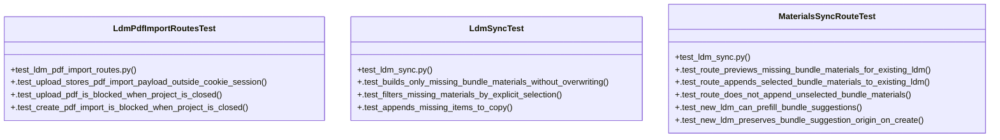

# Community 6

> 67 nodes · cohesion 0.06

## Key Concepts

- [materials.py](file:///Users/macbook/ProjectTracker/tracker/routes/materials.py#L1) (47 connections)
- [import_ldm_csv_upload()](file:///Users/macbook/ProjectTracker/tracker/routes/materials.py#L266) (15 connections)
- [missing_ldm_items_from_bundles()](file:///Users/macbook/ProjectTracker/tracker/ldm_sync.py#L52) (12 connections)
- [hydrate_ldm()](file:///Users/macbook/ProjectTracker/tracker/catalog.py#L470) (11 connections)
- [_find_project()](file:///Users/macbook/ProjectTracker/tracker/routes/materials.py#L31) (11 connections)
- [import_ldm_pdf_create()](file:///Users/macbook/ProjectTracker/tracker/routes/materials.py#L732) (11 connections)
- [sync_ldm_bundles()](file:///Users/macbook/ProjectTracker/tracker/routes/materials.py#L442) (11 connections)
- [new_ldm()](file:///Users/macbook/ProjectTracker/tracker/routes/materials.py#L219) (10 connections)
- [ldm_sync.py](file:///Users/macbook/ProjectTracker/tracker/ldm_sync.py#L1) (10 connections)
- [edit_ldm()](file:///Users/macbook/ProjectTracker/tracker/routes/materials.py#L379) (9 connections)
- [import_ldm_pdf_map()](file:///Users/macbook/ProjectTracker/tracker/routes/materials.py#L704) (9 connections)
- [_bundle_suggestion_ldm()](file:///Users/macbook/ProjectTracker/tracker/routes/materials.py#L157) (8 connections)
- [_clear_pdf_import()](file:///Users/macbook/ProjectTracker/tracker/routes/materials.py#L609) (7 connections)
- [import_ldm_pdf_upload()](file:///Users/macbook/ProjectTracker/tracker/routes/materials.py#L647) (7 connections)
- [_load_pdf_import()](file:///Users/macbook/ProjectTracker/tracker/routes/materials.py#L626) (7 connections)
- [ldm_from_form()](file:///Users/macbook/ProjectTracker/tracker/form_models.py#L138) (6 connections)
- [_bundle_sync_suggestions()](file:///Users/macbook/ProjectTracker/tracker/routes/materials.py#L194) (6 connections)
- [_ldm_csv_response()](file:///Users/macbook/ProjectTracker/tracker/routes/materials.py#L122) (6 connections)
- [ldm_pdf()](file:///Users/macbook/ProjectTracker/tracker/routes/materials.py#L559) (6 connections)
- [_pdf_import_path()](file:///Users/macbook/ProjectTracker/tracker/routes/materials.py#L602) (6 connections)
- [_render_ldm_form()](file:///Users/macbook/ProjectTracker/tracker/routes/materials.py#L146) (6 connections)
- [MaterialsSyncRouteTest](file:///Users/macbook/ProjectTracker/tests/test_ldm_sync.py#L80) (6 connections)
- [_aggregate_ldm_qty_by_catalog()](file:///Users/macbook/ProjectTracker/tracker/ldm_sync.py#L25) (5 connections)
- [selected_missing_bundle_items()](file:///Users/macbook/ProjectTracker/tracker/ldm_sync.py#L95) (5 connections)
- [_clean_form_text()](file:///Users/macbook/ProjectTracker/tracker/routes/materials.py#L27) (5 connections)
- *... and 42 more nodes in this community*

## Class Diagram

```mermaid
classDiagram
    class LdmPdfImportRoutesTest {
        +test_ldm_pdf_import_routes.py()
        +.test_upload_stores_pdf_import_payload_outside_cookie_session()
        +.test_upload_pdf_is_blocked_when_project_is_closed()
        +.test_create_pdf_import_is_blocked_when_project_is_closed()
    }
    class LdmSyncTest {
        +test_ldm_sync.py()
        +.test_builds_only_missing_bundle_materials_without_overwriting()
        +.test_filters_missing_materials_by_explicit_selection()
        +.test_appends_missing_items_to_copy()
    }
    class MaterialsSyncRouteTest {
        +test_ldm_sync.py()
        +.test_route_previews_missing_bundle_materials_for_existing_ldm()
        +.test_route_appends_selected_bundle_materials_to_existing_ldm()
        +.test_route_does_not_append_unselected_bundle_materials()
        +.test_new_ldm_can_prefill_bundle_suggestions()
        +.test_new_ldm_preserves_bundle_suggestion_origin_on_create()
    }
```

## Relationships

- [[Community 14]] (5 shared connections)
- [[Community 7]] (3 shared connections)

## Source Files

- [/Users/macbook/ProjectTracker/tests/test_ldm_pdf_import_routes.py](file:///Users/macbook/ProjectTracker/tests/test_ldm_pdf_import_routes.py)
- [/Users/macbook/ProjectTracker/tests/test_ldm_sync.py](file:///Users/macbook/ProjectTracker/tests/test_ldm_sync.py)
- [/Users/macbook/ProjectTracker/tracker/catalog.py](file:///Users/macbook/ProjectTracker/tracker/catalog.py)
- [/Users/macbook/ProjectTracker/tracker/form_models.py](file:///Users/macbook/ProjectTracker/tracker/form_models.py)
- [/Users/macbook/ProjectTracker/tracker/ldm_sync.py](file:///Users/macbook/ProjectTracker/tracker/ldm_sync.py)
- [/Users/macbook/ProjectTracker/tracker/routes/materials.py](file:///Users/macbook/ProjectTracker/tracker/routes/materials.py)

## Audit Trail

- EXTRACTED: 247 (72%)
- INFERRED: 97 (28%)
- AMBIGUOUS: 0 (0%)

---

*Part of the graphify knowledge wiki. See [[index]] to navigate.*