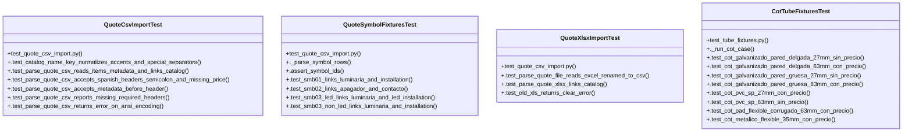

# Community 6

> 70 nodes · cohesion 0.05

## Key Concepts

- [parse_quote_csv()](file:///Users/macbook/ProjectTracker/tracker/quote_csv_import.py#L131) (24 connections)
- [quote_csv_import.py](file:///Users/macbook/ProjectTracker/tracker/quote_csv_import.py#L1) (21 connections)
- [CotTubeFixturesTest](file:///Users/macbook/ProjectTracker/tests/test_tube_fixtures.py#L282) (16 connections)
- [parse_quote_xlsx()](file:///Users/macbook/ProjectTracker/tracker/quote_csv_import.py#L277) (14 connections)
- [._run_cot_case()](file:///Users/macbook/ProjectTracker/tests/test_tube_fixtures.py#L284) (14 connections)
- [parse_quote_file()](file:///Users/macbook/ProjectTracker/tracker/quote_csv_import.py#L387) (8 connections)
- [QuoteCsvImportTest](file:///Users/macbook/ProjectTracker/tests/test_quote_csv_import.py#L9) (7 connections)
- [QuoteSymbolFixturesTest](file:///Users/macbook/ProjectTracker/tests/test_quote_csv_import.py#L136) (7 connections)
- [_header_key()](file:///Users/macbook/ProjectTracker/tracker/quote_csv_import.py#L53) (6 connections)
- [.assert_symbol_ids()](file:///Users/macbook/ProjectTracker/tests/test_quote_csv_import.py#L146) (6 connections)
- [_write_cot()](file:///Users/macbook/ProjectTracker/tests/test_tube_fixtures.py#L67) (6 connections)
- [_metadata_value()](file:///Users/macbook/ProjectTracker/tracker/quote_csv_import.py#L88) (5 connections)
- [_xlsx_metadata()](file:///Users/macbook/ProjectTracker/tracker/quote_csv_import.py#L265) (5 connections)
- [_build_export_like_xlsx()](file:///Users/macbook/ProjectTracker/tests/test_quote_csv_import.py#L189) (5 connections)
- [test_tube_fixtures.py](file:///Users/macbook/ProjectTracker/tests/test_tube_fixtures.py#L1) (5 connections)
- [_build_catalog_index()](file:///Users/macbook/ProjectTracker/tracker/quote_csv_import.py#L93) (4 connections)
- [_column_index()](file:///Users/macbook/ProjectTracker/tracker/quote_csv_import.py#L106) (4 connections)
- [_find_header_row()](file:///Users/macbook/ProjectTracker/tracker/quote_csv_import.py#L119) (4 connections)
- [_find_table_header()](file:///Users/macbook/ProjectTracker/tracker/quote_csv_import.py#L254) (4 connections)
- [_match_catalog()](file:///Users/macbook/ProjectTracker/tracker/quote_csv_import.py#L102) (4 connections)
- [_row_value()](file:///Users/macbook/ProjectTracker/tracker/quote_csv_import.py#L113) (4 connections)
- [_xlsx_rows()](file:///Users/macbook/ProjectTracker/tracker/quote_csv_import.py#L240) (4 connections)
- [QuoteXlsxImportTest](file:///Users/macbook/ProjectTracker/tests/test_quote_csv_import.py#L222) (4 connections)
- [.test_parse_quote_file_reads_excel_renamed_to_csv()](file:///Users/macbook/ProjectTracker/tests/test_quote_csv_import.py#L223) (4 connections)
- [.test_cot_mixed_tubes_single_file()](file:///Users/macbook/ProjectTracker/tests/test_tube_fixtures.py#L353) (4 connections)
- *... and 45 more nodes in this community*

## Class Diagram

```mermaid
classDiagram
    class QuoteCsvImportTest {
        +test_quote_csv_import.py()
        +.test_catalog_name_key_normalizes_accents_and_special_separators()
        +.test_parse_quote_csv_reads_items_metadata_and_links_catalog()
        +.test_parse_quote_csv_accepts_spanish_headers_semicolon_and_missing_price()
        +.test_parse_quote_csv_accepts_metadata_before_header()
        +.test_parse_quote_csv_reports_missing_required_headers()
        +.test_parse_quote_csv_returns_error_on_ansi_encoding()
    }
    class QuoteSymbolFixturesTest {
        +test_quote_csv_import.py()
        +._parse_symbol_rows()
        +.assert_symbol_ids()
        +.test_smb01_links_luminaria_and_installation()
        +.test_smb02_links_apagador_and_contacto()
        +.test_smb03_led_links_luminaria_and_led_installation()
        +.test_smb03_non_led_links_luminaria_and_installation()
    }
    class QuoteXlsxImportTest {
        +test_quote_csv_import.py()
        +.test_parse_quote_file_reads_excel_renamed_to_csv()
        +.test_parse_quote_xlsx_links_catalog()
        +.test_old_xls_returns_clear_error()
    }
    class CotTubeFixturesTest {
        +test_tube_fixtures.py()
        +._run_cot_case()
        +.test_cot_galvanizado_pared_delgada_27mm_sin_precio()
        +.test_cot_galvanizado_pared_delgada_63mm_con_precio()
        +.test_cot_galvanizado_pared_gruesa_27mm_sin_precio()
        +.test_cot_galvanizado_pared_gruesa_63mm_con_precio()
        +.test_cot_pvc_sp_27mm_con_precio()
        +.test_cot_pvc_sp_63mm_sin_precio()
        +.test_cot_pad_flexible_corrugado_63mm_con_precio()
        +.test_cot_metalico_flexible_35mm_con_precio()
    }
```

## Relationships

- No strong cross-community connections detected

## Source Files

- [/Users/macbook/ProjectTracker/tests/test_quote_csv_import.py](file:///Users/macbook/ProjectTracker/tests/test_quote_csv_import.py)
- [/Users/macbook/ProjectTracker/tests/test_tube_fixtures.py](file:///Users/macbook/ProjectTracker/tests/test_tube_fixtures.py)
- [/Users/macbook/ProjectTracker/tracker/quote_csv_import.py](file:///Users/macbook/ProjectTracker/tracker/quote_csv_import.py)

## Audit Trail

- EXTRACTED: 243 (88%)
- INFERRED: 33 (12%)
- AMBIGUOUS: 0 (0%)

---

*Part of the graphify knowledge wiki. See [[index]] to navigate.*