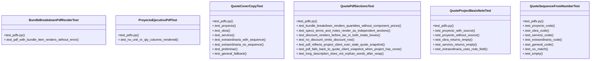

# Community 6

> 68 nodes · cohesion 0.06

## Key Concepts

- [build_quote_pdf()](file:///Users/macbook/ProjectTracker/tracker/pdfs.py#L251) (35 connections)
- [pdfs.py](file:///Users/macbook/ProjectTracker/tracker/pdfs.py#L1) (22 connections)
- [build_ldm_pdf()](file:///Users/macbook/ProjectTracker/tracker/pdfs.py#L1423) (14 connections)
- [quote_cover_copy()](file:///Users/macbook/ProjectTracker/tracker/pdfs.py#L208) (12 connections)
- [_safe_text()](file:///Users/macbook/ProjectTracker/tracker/pdfs.py#L52) (11 connections)
- [build_progress_pdf()](file:///Users/macbook/ProjectTracker/tracker/pdfs.py#L1907) (9 connections)
- [quote_sequence_from_number()](file:///Users/macbook/ProjectTracker/tracker/pdfs.py#L203) (9 connections)
- [quote_project_basis_note()](file:///Users/macbook/ProjectTracker/tracker/pdfs.py#L228) (8 connections)
- [QuoteCoverCopyTest](file:///Users/macbook/ProjectTracker/tests/test_pdfs.py#L13) (8 connections)
- [QuotePdfSectionsTest](file:///Users/macbook/ProjectTracker/tests/test_pdfs.py#L147) (8 connections)
- [QuoteSequenceFromNumberTest](file:///Users/macbook/ProjectTracker/tests/test_pdfs.py#L77) (8 connections)
- [_load_company()](file:///Users/macbook/ProjectTracker/tracker/pdfs.py#L136) (7 connections)
- [QuoteProjectBasisNoteTest](file:///Users/macbook/ProjectTracker/tests/test_pdfs.py#L52) (6 connections)
- [test_pdfs.py](file:///Users/macbook/ProjectTracker/tests/test_pdfs.py#L1) (6 connections)
- [catalog_description_lookup()](file:///Users/macbook/Documents/ProjectTracker/tracker/catalog.py#L182) (5 connections)
- [_fitted_cell()](file:///Users/macbook/ProjectTracker/tracker/pdfs.py#L82) (5 connections)
- [quote_logo_path()](file:///Users/macbook/ProjectTracker/tracker/pdfs.py#L150) (5 connections)
- [_register_pdf_fonts()](file:///Users/macbook/ProjectTracker/tracker/pdfs.py#L71) (5 connections)
- [format_date_long()](file:///Users/macbook/ProjectTracker/tracker/pdfs.py#L94) (4 connections)
- [format_date_short()](file:///Users/macbook/ProjectTracker/tracker/pdfs.py#L108) (4 connections)
- [_hex_to_rgb()](file:///Users/macbook/ProjectTracker/tracker/pdfs.py#L41) (4 connections)
- [money_pdf()](file:///Users/macbook/ProjectTracker/tracker/pdfs.py#L120) (4 connections)
- [note_lines()](file:///Users/macbook/ProjectTracker/tracker/pdfs.py#L129) (4 connections)
- [quote_catalog_description()](file:///Users/macbook/ProjectTracker/tracker/pdfs.py#L244) (4 connections)
- [_company_name()](file:///Users/macbook/ProjectTracker/tracker/pdfs.py#L173) (3 connections)
- *... and 43 more nodes in this community*

## Class Diagram

```mermaid
classDiagram
    class BundleBreakdownPdfRenderTest {
        +test_pdfs.py()
        +.test_pdf_with_bundle_item_renders_without_error()
    }
    class ProyectoEjecutivoPdfTest {
        +test_pdfs.py()
        +.test_no_unit_or_qty_columns_rendered()
    }
    class QuoteCoverCopyTest {
        +test_pdfs.py()
        +.test_proyecto()
        +.test_obra()
        +.test_servicio()
        +.test_extraordinaria_with_sequence()
        +.test_extraordinaria_no_sequence()
        +.test_preliminar()
        +.test_general_fallback()
    }
    class QuotePdfSectionsTest {
        +test_pdfs.py()
        +.test_bundle_breakdown_renders_quantities_without_component_prices()
        +.test_specs_terms_and_notes_render_as_independent_sections()
        +.test_discount_renders_before_tax_in_both_totals_boxes()
        +.test_no_discount_omits_discount_row()
        +.test_pdf_reflects_project_client_over_stale_quote_snapshot()
        +.test_pdf_falls_back_to_quote_client_snapshot_when_project_has_none()
        +.test_long_description_does_not_orphan_words_after_wrap()
    }
    class QuoteProjectBasisNoteTest {
        +test_pdfs.py()
        +.test_proyecto_with_source()
        +.test_proyecto_without_source()
        +.test_obra_returns_empty()
        +.test_servicio_returns_empty()
        +.test_extraordinaria_uses_note_field()
    }
    class QuoteSequenceFromNumberTest {
        +test_pdfs.py()
        +.test_proyecto_code()
        +.test_obra_code()
        +.test_servicio_code()
        +.test_extraordinaria_code()
        +.test_general_code()
        +.test_no_match()
        +.test_empty()
    }
```

## Relationships

- No strong cross-community connections detected

## Source Files

- [/Users/macbook/Documents/ProjectTracker/tracker/catalog.py](file:///Users/macbook/Documents/ProjectTracker/tracker/catalog.py)
- [/Users/macbook/Documents/ProjectTracker/tracker/pdfs.py](file:///Users/macbook/Documents/ProjectTracker/tracker/pdfs.py)
- [/Users/macbook/ProjectTracker/tests/test_pdfs.py](file:///Users/macbook/ProjectTracker/tests/test_pdfs.py)
- [/Users/macbook/ProjectTracker/tracker/pdfs.py](file:///Users/macbook/ProjectTracker/tracker/pdfs.py)

## Audit Trail

- EXTRACTED: 206 (71%)
- INFERRED: 83 (29%)
- AMBIGUOUS: 0 (0%)

---

*Part of the graphify knowledge wiki. See [[index]] to navigate.*