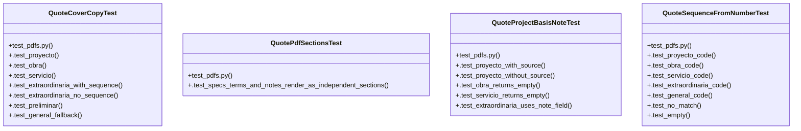

# Community 7

> 51 nodes · cohesion 0.08

## Key Concepts

- [pdfs.py](file:///Users/macbook/ProjectTracker/tracker/pdfs.py#L1) (27 connections)
- [build_quote_pdf()](file:///Users/macbook/ProjectTracker/tracker/pdfs.py#L234) (21 connections)
- [build_ldm_pdf()](file:///Users/macbook/ProjectTracker/tracker/pdfs.py#L1117) (13 connections)
- [quote_cover_copy()](file:///Users/macbook/ProjectTracker/tracker/pdfs.py#L191) (12 connections)
- [build_progress_pdf()](file:///Users/macbook/ProjectTracker/tracker/pdfs.py#L1587) (9 connections)
- [quote_sequence_from_number()](file:///Users/macbook/ProjectTracker/tracker/pdfs.py#L186) (9 connections)
- [_safe_text()](file:///Users/macbook/ProjectTracker/tracker/pdfs.py#L45) (9 connections)
- [quote_project_basis_note()](file:///Users/macbook/ProjectTracker/tracker/pdfs.py#L211) (8 connections)
- [QuoteCoverCopyTest](file:///Users/macbook/ProjectTracker/tests/test_pdfs.py#L13) (8 connections)
- [QuoteSequenceFromNumberTest](file:///Users/macbook/ProjectTracker/tests/test_pdfs.py#L77) (8 connections)
- [_load_company()](file:///Users/macbook/ProjectTracker/tracker/pdfs.py#L119) (7 connections)
- [QuoteProjectBasisNoteTest](file:///Users/macbook/ProjectTracker/tests/test_pdfs.py#L52) (6 connections)
- [catalog_description_lookup()](file:///Users/macbook/ProjectTracker/tracker/catalog.py#L163) (5 connections)
- [format_date_long()](file:///Users/macbook/ProjectTracker/tracker/pdfs.py#L89) (5 connections)
- [quote_logo_path()](file:///Users/macbook/ProjectTracker/tracker/pdfs.py#L133) (5 connections)
- [_register_dejavu()](file:///Users/macbook/ProjectTracker/tracker/pdfs.py#L64) (5 connections)
- [_hex_to_rgb()](file:///Users/macbook/ProjectTracker/tracker/pdfs.py#L34) (4 connections)
- [money_pdf()](file:///Users/macbook/ProjectTracker/tracker/pdfs.py#L103) (4 connections)
- [note_lines()](file:///Users/macbook/ProjectTracker/tracker/pdfs.py#L112) (4 connections)
- [quote_catalog_description()](file:///Users/macbook/ProjectTracker/tracker/pdfs.py#L227) (4 connections)
- [test_pdfs.py](file:///Users/macbook/ProjectTracker/tests/test_pdfs.py#L1) (4 connections)
- [_company_name()](file:///Users/macbook/ProjectTracker/tracker/pdfs.py#L156) (3 connections)
- [quote_scope_paragraphs()](file:///Users/macbook/ProjectTracker/tracker/pdfs.py#L160) (3 connections)
- [quote_terms()](file:///Users/macbook/ProjectTracker/tracker/pdfs.py#L182) (3 connections)
- [.test_extraordinaria_no_sequence()](file:///Users/macbook/ProjectTracker/tests/test_pdfs.py#L37) (2 connections)
- *... and 26 more nodes in this community*

## Class Diagram

## Relationships

- No strong cross-community connections detected

## Source Files

- [/Users/macbook/ProjectTracker/tests/test_pdfs.py](file:///Users/macbook/ProjectTracker/tests/test_pdfs.py)
- [/Users/macbook/ProjectTracker/tracker/catalog.py](file:///Users/macbook/ProjectTracker/tracker/catalog.py)
- [/Users/macbook/ProjectTracker/tracker/pdfs.py](file:///Users/macbook/ProjectTracker/tracker/pdfs.py)

## Audit Trail

- EXTRACTED: 173 (74%)
- INFERRED: 61 (26%)
- AMBIGUOUS: 0 (0%)

---

*Part of the graphify knowledge wiki. See [[index]] to navigate.*