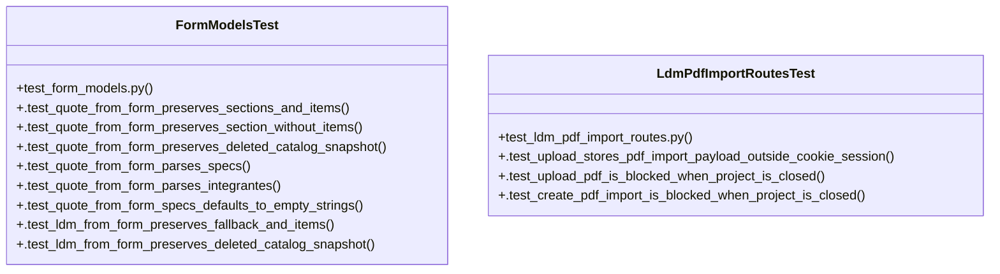

# Community 7

> 55 nodes · cohesion 0.08

## Key Concepts

- [materials.py](file:///Users/macbook/ProjectTracker/tracker/routes/materials.py#L1) (47 connections)
- [import_ldm_csv_upload()](file:///Users/macbook/ProjectTracker/tracker/routes/materials.py#L266) (15 connections)
- [quote_from_form()](file:///Users/macbook/ProjectTracker/tracker/form_models.py#L24) (12 connections)
- [hydrate_ldm()](file:///Users/macbook/ProjectTracker/tracker/catalog.py#L392) (11 connections)
- [_find_project()](file:///Users/macbook/ProjectTracker/tracker/routes/materials.py#L31) (11 connections)
- [import_ldm_pdf_create()](file:///Users/macbook/ProjectTracker/tracker/routes/materials.py#L732) (11 connections)
- [sync_ldm_bundles()](file:///Users/macbook/ProjectTracker/tracker/routes/materials.py#L442) (11 connections)
- [form_models.py](file:///Users/macbook/ProjectTracker/tracker/form_models.py#L1) (11 connections)
- [new_ldm()](file:///Users/macbook/ProjectTracker/tracker/routes/materials.py#L219) (10 connections)
- [edit_ldm()](file:///Users/macbook/ProjectTracker/tracker/routes/materials.py#L379) (9 connections)
- [import_ldm_pdf_map()](file:///Users/macbook/ProjectTracker/tracker/routes/materials.py#L704) (9 connections)
- [FormModelsTest](file:///Users/macbook/ProjectTracker/tests/test_form_models.py#L8) (9 connections)
- [_bundle_suggestion_ldm()](file:///Users/macbook/ProjectTracker/tracker/routes/materials.py#L157) (8 connections)
- [_clear_pdf_import()](file:///Users/macbook/ProjectTracker/tracker/routes/materials.py#L609) (7 connections)
- [import_ldm_pdf_upload()](file:///Users/macbook/ProjectTracker/tracker/routes/materials.py#L647) (7 connections)
- [_load_pdf_import()](file:///Users/macbook/ProjectTracker/tracker/routes/materials.py#L626) (7 connections)
- [ldm_from_form()](file:///Users/macbook/ProjectTracker/tracker/form_models.py#L131) (6 connections)
- [_bundle_sync_suggestions()](file:///Users/macbook/ProjectTracker/tracker/routes/materials.py#L194) (6 connections)
- [_ldm_csv_response()](file:///Users/macbook/ProjectTracker/tracker/routes/materials.py#L122) (6 connections)
- [ldm_pdf()](file:///Users/macbook/ProjectTracker/tracker/routes/materials.py#L559) (6 connections)
- [_pdf_import_path()](file:///Users/macbook/ProjectTracker/tracker/routes/materials.py#L602) (6 connections)
- [_render_ldm_form()](file:///Users/macbook/ProjectTracker/tracker/routes/materials.py#L146) (6 connections)
- [_clean_form_text()](file:///Users/macbook/ProjectTracker/tracker/routes/materials.py#L27) (5 connections)
- [_store_pdf_import()](file:///Users/macbook/ProjectTracker/tracker/routes/materials.py#L617) (5 connections)
- [_csv_already_imported()](file:///Users/macbook/ProjectTracker/tracker/routes/materials.py#L59) (4 connections)
- *... and 30 more nodes in this community*

## Class Diagram

## Relationships

- No strong cross-community connections detected

## Source Files

- [/Users/macbook/ProjectTracker/tests/test_form_models.py](file:///Users/macbook/ProjectTracker/tests/test_form_models.py)
- [/Users/macbook/ProjectTracker/tests/test_ldm_pdf_import_routes.py](file:///Users/macbook/ProjectTracker/tests/test_ldm_pdf_import_routes.py)
- [/Users/macbook/ProjectTracker/tracker/catalog.py](file:///Users/macbook/ProjectTracker/tracker/catalog.py)
- [/Users/macbook/ProjectTracker/tracker/form_models.py](file:///Users/macbook/ProjectTracker/tracker/form_models.py)
- [/Users/macbook/ProjectTracker/tracker/routes/materials.py](file:///Users/macbook/ProjectTracker/tracker/routes/materials.py)

## Audit Trail

- EXTRACTED: 214 (68%)
- INFERRED: 102 (32%)
- AMBIGUOUS: 0 (0%)

---

*Part of the graphify knowledge wiki. See [[index]] to navigate.*