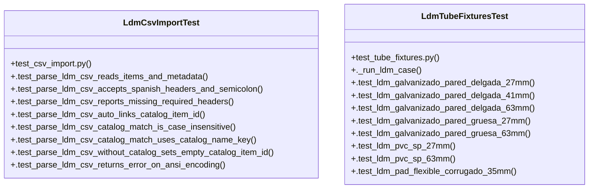

# Community 8

> 45 nodes · cohesion 0.08

## Key Concepts

- [parse_ldm_csv()](file:///Users/macbook/ProjectTracker/tracker/csv_import.py#L78) (21 connections)
- [LdmTubeFixturesTest](file:///Users/macbook/ProjectTracker/tests/test_tube_fixtures.py#L139) (17 connections)
- [._run_ldm_case()](file:///Users/macbook/ProjectTracker/tests/test_tube_fixtures.py#L141) (16 connections)
- [csv_import.py](file:///Users/macbook/ProjectTracker/tracker/csv_import.py#L1) (11 connections)
- [LdmCsvImportTest](file:///Users/macbook/ProjectTracker/tests/test_csv_import.py#L8) (9 connections)
- [_clean()](file:///Users/macbook/ProjectTracker/tracker/csv_import.py#L11) (5 connections)
- [_write_ldm()](file:///Users/macbook/ProjectTracker/tests/test_tube_fixtures.py#L52) (5 connections)
- [_build_catalog_index()](file:///Users/macbook/ProjectTracker/tracker/csv_import.py#L63) (4 connections)
- [_first_value()](file:///Users/macbook/ProjectTracker/tracker/csv_import.py#L19) (4 connections)
- [_header_key()](file:///Users/macbook/ProjectTracker/tracker/csv_import.py#L15) (4 connections)
- [_match_catalog()](file:///Users/macbook/ProjectTracker/tracker/csv_import.py#L73) (4 connections)
- [.test_ldm_mixed_tubes_single_file()](file:///Users/macbook/ProjectTracker/tests/test_tube_fixtures.py#L195) (4 connections)
- [.test_ldm_with_metadata_proveedor_fecha()](file:///Users/macbook/ProjectTracker/tests/test_tube_fixtures.py#L213) (4 connections)
- [_detect_dialect()](file:///Users/macbook/ProjectTracker/tracker/csv_import.py#L53) (3 connections)
- [_parse_float()](file:///Users/macbook/ProjectTracker/tracker/csv_import.py#L26) (3 connections)
- [.test_parse_ldm_csv_returns_error_on_ansi_encoding()](file:///Users/macbook/ProjectTracker/tests/test_csv_import.py#L111) (3 connections)
- [_read_sample()](file:///Users/macbook/ProjectTracker/tracker/csv_import.py#L45) (2 connections)
- [.test_parse_ldm_csv_accepts_spanish_headers_and_semicolon()](file:///Users/macbook/ProjectTracker/tests/test_csv_import.py#L30) (2 connections)
- [.test_parse_ldm_csv_auto_links_catalog_item_id()](file:///Users/macbook/ProjectTracker/tests/test_csv_import.py#L54) (2 connections)
- [.test_parse_ldm_csv_catalog_match_is_case_insensitive()](file:///Users/macbook/ProjectTracker/tests/test_csv_import.py#L74) (2 connections)
- [.test_parse_ldm_csv_catalog_match_uses_catalog_name_key()](file:///Users/macbook/ProjectTracker/tests/test_csv_import.py#L88) (2 connections)
- [.test_parse_ldm_csv_reads_items_and_metadata()](file:///Users/macbook/ProjectTracker/tests/test_csv_import.py#L9) (2 connections)
- [.test_parse_ldm_csv_reports_missing_required_headers()](file:///Users/macbook/ProjectTracker/tests/test_csv_import.py#L43) (2 connections)
- [.test_parse_ldm_csv_without_catalog_sets_empty_catalog_item_id()](file:///Users/macbook/ProjectTracker/tests/test_csv_import.py#L99) (2 connections)
- [.test_ldm_flexible_licuatite_35mm()](file:///Users/macbook/ProjectTracker/tests/test_tube_fixtures.py#L189) (2 connections)
- *... and 20 more nodes in this community*

## Class Diagram

## Relationships

- No strong cross-community connections detected

## Source Files

- [/Users/macbook/ProjectTracker/tests/test_csv_import.py](file:///Users/macbook/ProjectTracker/tests/test_csv_import.py)
- [/Users/macbook/ProjectTracker/tests/test_tube_fixtures.py](file:///Users/macbook/ProjectTracker/tests/test_tube_fixtures.py)
- [/Users/macbook/ProjectTracker/tracker/csv_import.py](file:///Users/macbook/ProjectTracker/tracker/csv_import.py)

## Audit Trail

- EXTRACTED: 142 (85%)
- INFERRED: 25 (15%)
- AMBIGUOUS: 0 (0%)

---

*Part of the graphify knowledge wiki. See [[index]] to navigate.*