# Community 9

> 43 nodes · cohesion 0.07

## Key Concepts

- [filter_catalog()](file:///Users/macbook/ProjectTracker/tracker/catalog_search.py#L63) (13 connections)
- [match_item()](file:///Users/macbook/ProjectTracker/tracker/catalog_search.py#L47) (11 connections)
- [tokenize()](file:///Users/macbook/ProjectTracker/tracker/catalog_search.py#L32) (8 connections)
- [catalog_search.py](file:///Users/macbook/ProjectTracker/tracker/catalog_search.py#L1) (8 connections)
- [_normalize()](file:///Users/macbook/ProjectTracker/tracker/catalog_search.py#L25) (7 connections)
- [FilterCatalogTest](file:///Users/macbook/ProjectTracker/tests/test_catalog_search.py#L57) (7 connections)
- [MatchItemTest](file:///Users/macbook/ProjectTracker/tests/test_catalog_search.py#L23) (7 connections)
- [test_catalog_search.py](file:///Users/macbook/ProjectTracker/tests/test_catalog_search.py#L1) (7 connections)
- [list_categories()](file:///Users/macbook/ProjectTracker/tracker/catalog_search.py#L75) (6 connections)
- [ApiCatalogoTest](file:///Users/macbook/ProjectTracker/tests/test_catalog_search.py#L114) (5 connections)
- [TokenizeTest](file:///Users/macbook/ProjectTracker/tests/test_catalog_search.py#L8) (5 connections)
- [_indexable_text()](file:///Users/macbook/ProjectTracker/tracker/catalog_search.py#L37) (4 connections)
- [.test_combined_tokens_and_category()](file:///Users/macbook/ProjectTracker/tests/test_catalog_search.py#L88) (2 connections)
- [.test_filter_by_category()](file:///Users/macbook/ProjectTracker/tests/test_catalog_search.py#L81) (2 connections)
- [.test_filters_by_token_and_returns_alphabetical()](file:///Users/macbook/ProjectTracker/tests/test_catalog_search.py#L65) (2 connections)
- [.test_multiple_tokens_must_all_match()](file:///Users/macbook/ProjectTracker/tests/test_catalog_search.py#L70) (2 connections)
- [.test_no_filters_returns_all_sorted()](file:///Users/macbook/ProjectTracker/tests/test_catalog_search.py#L92) (2 connections)
- [.test_tokens_match_across_fields_including_category()](file:///Users/macbook/ProjectTracker/tests/test_catalog_search.py#L75) (2 connections)
- [ListCategoriesTest](file:///Users/macbook/ProjectTracker/tests/test_catalog_search.py#L99) (2 connections)
- [.test_returns_unique_sorted_non_empty()](file:///Users/macbook/ProjectTracker/tests/test_catalog_search.py#L100) (2 connections)
- [.test_all_tokens_must_match()](file:///Users/macbook/ProjectTracker/tests/test_catalog_search.py#L30) (2 connections)
- [.test_categoria_filter_matches_normalized()](file:///Users/macbook/ProjectTracker/tests/test_catalog_search.py#L42) (2 connections)
- [.test_diacritics_and_case_ignored()](file:///Users/macbook/ProjectTracker/tests/test_catalog_search.py#L35) (2 connections)
- [.test_marca_field_is_searchable()](file:///Users/macbook/ProjectTracker/tests/test_catalog_search.py#L51) (2 connections)
- [.test_no_tokens_means_match()](file:///Users/macbook/ProjectTracker/tests/test_catalog_search.py#L39) (2 connections)
- *... and 18 more nodes in this community*

## Class Diagram

```mermaid
classDiagram
    class ApiCatalogoTest {
        +test_catalog_search.py()
        +.test_api_returns_json_list()
        +.test_api_accepts_query_parameters()
        +.test_api_categorias_returns_sorted_list()
    }
    class FilterCatalogTest {
        +test_catalog_search.py()
        +.test_filters_by_token_and_returns_alphabetical()
        +.test_multiple_tokens_must_all_match()
        +.test_tokens_match_across_fields_including_category()
        +.test_filter_by_category()
        +.test_combined_tokens_and_category()
        +.test_no_filters_returns_all_sorted()
    }
    class ListCategoriesTest {
        +test_catalog_search.py()
        +.test_returns_unique_sorted_non_empty()
    }
    class MatchItemTest {
        +test_catalog_search.py()
        +.test_all_tokens_must_match()
        +.test_diacritics_and_case_ignored()
        +.test_no_tokens_means_match()
        +.test_categoria_filter_matches_normalized()
        +.test_tokens_can_match_across_fields()
        +.test_marca_field_is_searchable()
    }
    class TokenizeTest {
        +test_catalog_search.py()
        +.test_splits_by_whitespace_and_normalizes()
        +.test_strips_diacritics()
        +.test_collapses_extra_whitespace()
        +.test_empty_query_yields_empty_list()
    }
```

## Relationships

- No strong cross-community connections detected

## Source Files

- [/Users/macbook/ProjectTracker/tests/test_catalog_search.py](file:///Users/macbook/ProjectTracker/tests/test_catalog_search.py)
- [/Users/macbook/ProjectTracker/tracker/catalog_search.py](file:///Users/macbook/ProjectTracker/tracker/catalog_search.py)

## Audit Trail

- EXTRACTED: 99 (72%)
- INFERRED: 38 (28%)
- AMBIGUOUS: 0 (0%)

---

*Part of the graphify knowledge wiki. See [[index]] to navigate.*