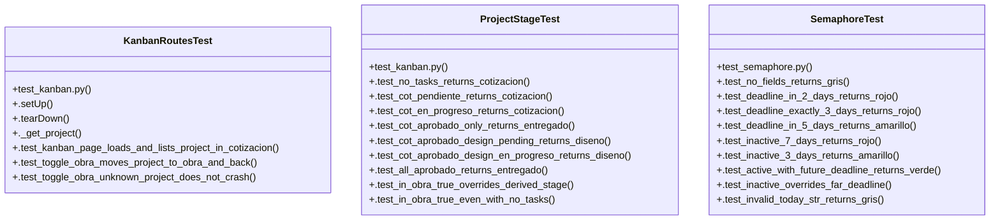

# Community 9

> 49 nodes · cohesion 0.07

## Key Concepts

- [domain.py](file:///Users/macbook/ProjectTracker/tracker/domain.py#L1) (19 connections)
- [project_semaphore()](file:///Users/macbook/ProjectTracker/tracker/domain.py#L135) (14 connections)
- [project_stage()](file:///Users/macbook/ProjectTracker/tracker/domain.py#L74) (13 connections)
- [SemaphoreTest](file:///Users/macbook/ProjectTracker/tests/test_semaphore.py#L8) (12 connections)
- [ProjectStageTest](file:///Users/macbook/ProjectTracker/tests/test_kanban.py#L39) (11 connections)
- [_task()](file:///Users/macbook/ProjectTracker/tests/test_kanban.py#L23) (9 connections)
- [KanbanRoutesTest](file:///Users/macbook/ProjectTracker/tests/test_kanban.py#L95) (8 connections)
- [kanban()](file:///Users/macbook/ProjectTracker/tracker/routes/projects.py#L71) (7 connections)
- [get_alcances()](file:///Users/macbook/ProjectTracker/tracker/domain.py#L24) (5 connections)
- [check_blocked()](file:///Users/macbook/ProjectTracker/tracker/domain.py#L66) (4 connections)
- [get_alcances_by_id()](file:///Users/macbook/ProjectTracker/tracker/domain.py#L31) (4 connections)
- [get_progress()](file:///Users/macbook/ProjectTracker/tracker/domain.py#L98) (4 connections)
- [._get_project()](file:///Users/macbook/ProjectTracker/tests/test_kanban.py#L112) (3 connections)
- [.test_all_aprobado_returns_entregado()](file:///Users/macbook/ProjectTracker/tests/test_kanban.py#L71) (3 connections)
- [.test_cot_aprobado_design_en_progreso_returns_diseno()](file:///Users/macbook/ProjectTracker/tests/test_kanban.py#L63) (3 connections)
- [.test_cot_aprobado_design_pending_returns_diseno()](file:///Users/macbook/ProjectTracker/tests/test_kanban.py#L56) (3 connections)
- [.test_cot_aprobado_only_returns_entregado()](file:///Users/macbook/ProjectTracker/tests/test_kanban.py#L52) (3 connections)
- [.test_cot_en_progreso_returns_cotizacion()](file:///Users/macbook/ProjectTracker/tests/test_kanban.py#L48) (3 connections)
- [.test_cot_pendiente_returns_cotizacion()](file:///Users/macbook/ProjectTracker/tests/test_kanban.py#L44) (3 connections)
- [.test_in_obra_true_overrides_derived_stage()](file:///Users/macbook/ProjectTracker/tests/test_kanban.py#L79) (3 connections)
- [.test_subtasks_not_counted()](file:///Users/macbook/ProjectTracker/tests/test_kanban.py#L88) (3 connections)
- [test_kanban.py](file:///Users/macbook/ProjectTracker/tests/test_kanban.py#L1) (3 connections)
- [alcances_admin()](file:///Users/macbook/ProjectTracker/tracker/routes/admin.py#L1046) (2 connections)
- [get_info_ext_excluded()](file:///Users/macbook/ProjectTracker/tracker/domain.py#L35) (2 connections)
- [today_short()](file:///Users/macbook/ProjectTracker/tracker/domain.py#L131) (2 connections)
- *... and 24 more nodes in this community*

## Class Diagram

```mermaid
classDiagram
    class KanbanRoutesTest {
        +test_kanban.py()
        +.setUp()
        +.tearDown()
        +._get_project()
        +.test_kanban_page_loads_and_lists_project_in_cotizacion()
        +.test_toggle_obra_moves_project_to_obra_and_back()
        +.test_toggle_obra_unknown_project_does_not_crash()
    }
    class ProjectStageTest {
        +test_kanban.py()
        +.test_no_tasks_returns_cotizacion()
        +.test_cot_pendiente_returns_cotizacion()
        +.test_cot_en_progreso_returns_cotizacion()
        +.test_cot_aprobado_only_returns_entregado()
        +.test_cot_aprobado_design_pending_returns_diseno()
        +.test_cot_aprobado_design_en_progreso_returns_diseno()
        +.test_all_aprobado_returns_entregado()
        +.test_in_obra_true_overrides_derived_stage()
        +.test_in_obra_true_even_with_no_tasks()
    }
    class SemaphoreTest {
        +test_semaphore.py()
        +.test_no_fields_returns_gris()
        +.test_deadline_in_2_days_returns_rojo()
        +.test_deadline_exactly_3_days_returns_rojo()
        +.test_deadline_in_5_days_returns_amarillo()
        +.test_inactive_7_days_returns_rojo()
        +.test_inactive_3_days_returns_amarillo()
        +.test_active_with_future_deadline_returns_verde()
        +.test_inactive_overrides_far_deadline()
        +.test_invalid_today_str_returns_gris()
    }
```

## Relationships

- No strong cross-community connections detected

## Source Files

- [/Users/macbook/ProjectTracker/tests/test_kanban.py](file:///Users/macbook/ProjectTracker/tests/test_kanban.py)
- [/Users/macbook/ProjectTracker/tests/test_semaphore.py](file:///Users/macbook/ProjectTracker/tests/test_semaphore.py)
- [/Users/macbook/ProjectTracker/tracker/domain.py](file:///Users/macbook/ProjectTracker/tracker/domain.py)
- [/Users/macbook/ProjectTracker/tracker/routes/admin.py](file:///Users/macbook/ProjectTracker/tracker/routes/admin.py)
- [/Users/macbook/ProjectTracker/tracker/routes/projects.py](file:///Users/macbook/ProjectTracker/tracker/routes/projects.py)

## Audit Trail

- EXTRACTED: 124 (67%)
- INFERRED: 61 (33%)
- AMBIGUOUS: 0 (0%)

---

*Part of the graphify knowledge wiki. See [[index]] to navigate.*