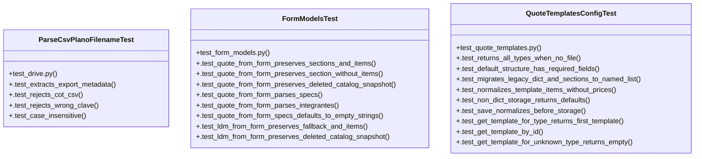

# Community 9

> 56 nodes · cohesion 0.06

## Key Concepts

- [quote_templates_config.py](file:///Users/macbook/ProjectTracker/tracker/quote_templates_config.py#L1) (17 connections)
- [quote_from_form()](file:///Users/macbook/ProjectTracker/tracker/form_models.py#L26) (12 connections)
- [get_quote_templates()](file:///Users/macbook/ProjectTracker/tracker/quote_templates_config.py#L196) (12 connections)
- [form_models.py](file:///Users/macbook/ProjectTracker/tracker/form_models.py#L1) (11 connections)
- [QuoteTemplatesConfigTest](file:///Users/macbook/ProjectTracker/tests/test_quote_templates.py#L5) (10 connections)
- [utils.py](file:///Users/macbook/ProjectTracker/tracker/utils.py#L1) (10 connections)
- [FormModelsTest](file:///Users/macbook/ProjectTracker/tests/test_form_models.py#L8) (9 connections)
- [_make_default_template()](file:///Users/macbook/ProjectTracker/tracker/quote_templates_config.py#L153) (6 connections)
- [_normalize_template()](file:///Users/macbook/ProjectTracker/tracker/quote_templates_config.py#L166) (6 connections)
- [parse_csv_plano_filename()](file:///Users/macbook/ProjectTracker/tracker/utils.py#L37) (6 connections)
- [get_template_for_type()](file:///Users/macbook/ProjectTracker/tracker/quote_templates_config.py#L210) (5 connections)
- [_normalize()](file:///Users/macbook/ProjectTracker/tracker/quote_templates_config.py#L179) (5 connections)
- [normalize_contact_rows()](file:///Users/macbook/ProjectTracker/tracker/quote_templates_config.py#L104) (5 connections)
- [save_quote_templates()](file:///Users/macbook/ProjectTracker/tracker/quote_templates_config.py#L206) (5 connections)
- [quote_templates()](file:///Users/macbook/ProjectTracker/tracker/routes/quotes.py#L1166) (5 connections)
- [ParseCsvPlanoFilenameTest](file:///Users/macbook/ProjectTracker/tests/test_drive.py#L6) (5 connections)
- [_normalize_contacts()](file:///Users/macbook/ProjectTracker/tracker/quote_templates_config.py#L91) (4 connections)
- [_normalize_sections()](file:///Users/macbook/ProjectTracker/tracker/quote_templates_config.py#L143) (4 connections)
- [clean()](file:///Users/macbook/ProjectTracker/tracker/utils.py#L6) (4 connections)
- [deleted_catalog_item_at()](file:///Users/macbook/ProjectTracker/tracker/utils.py#L60) (4 connections)
- [parse_float()](file:///Users/macbook/ProjectTracker/tracker/utils.py#L26) (4 connections)
- [get_template_by_id()](file:///Users/macbook/ProjectTracker/tracker/quote_templates_config.py#L215) (3 connections)
- [_new_id()](file:///Users/macbook/ProjectTracker/tracker/quote_templates_config.py#L87) (3 connections)
- [_normalize_section()](file:///Users/macbook/ProjectTracker/tracker/quote_templates_config.py#L126) (3 connections)
- [parse_form_float()](file:///Users/macbook/ProjectTracker/tracker/utils.py#L10) (3 connections)
- *... and 31 more nodes in this community*

## Class Diagram

```mermaid
classDiagram
    class ParseCsvPlanoFilenameTest {
        +test_drive.py()
        +.test_extracts_export_metadata()
        +.test_rejects_cot_csv()
        +.test_rejects_wrong_clave()
        +.test_case_insensitive()
    }
    class FormModelsTest {
        +test_form_models.py()
        +.test_quote_from_form_preserves_sections_and_items()
        +.test_quote_from_form_preserves_section_without_items()
        +.test_quote_from_form_preserves_deleted_catalog_snapshot()
        +.test_quote_from_form_parses_specs()
        +.test_quote_from_form_parses_integrantes()
        +.test_quote_from_form_specs_defaults_to_empty_strings()
        +.test_ldm_from_form_preserves_fallback_and_items()
        +.test_ldm_from_form_preserves_deleted_catalog_snapshot()
    }
    class QuoteTemplatesConfigTest {
        +test_quote_templates.py()
        +.test_returns_all_types_when_no_file()
        +.test_default_structure_has_required_fields()
        +.test_migrates_legacy_dict_and_sections_to_named_list()
        +.test_normalizes_template_items_without_prices()
        +.test_non_dict_storage_returns_defaults()
        +.test_save_normalizes_before_storage()
        +.test_get_template_for_type_returns_first_template()
        +.test_get_template_by_id()
        +.test_get_template_for_unknown_type_returns_empty()
    }
```

## Relationships

- No strong cross-community connections detected

## Source Files

- [/Users/macbook/ProjectTracker/tests/test_drive.py](file:///Users/macbook/ProjectTracker/tests/test_drive.py)
- [/Users/macbook/ProjectTracker/tests/test_form_models.py](file:///Users/macbook/ProjectTracker/tests/test_form_models.py)
- [/Users/macbook/ProjectTracker/tests/test_quote_templates.py](file:///Users/macbook/ProjectTracker/tests/test_quote_templates.py)
- [/Users/macbook/ProjectTracker/tracker/form_models.py](file:///Users/macbook/ProjectTracker/tracker/form_models.py)
- [/Users/macbook/ProjectTracker/tracker/quote_templates_config.py](file:///Users/macbook/ProjectTracker/tracker/quote_templates_config.py)
- [/Users/macbook/ProjectTracker/tracker/routes/quotes.py](file:///Users/macbook/ProjectTracker/tracker/routes/quotes.py)
- [/Users/macbook/ProjectTracker/tracker/utils.py](file:///Users/macbook/ProjectTracker/tracker/utils.py)

## Audit Trail

- EXTRACTED: 157 (73%)
- INFERRED: 58 (27%)
- AMBIGUOUS: 0 (0%)

---

*Part of the graphify knowledge wiki. See [[index]] to navigate.*