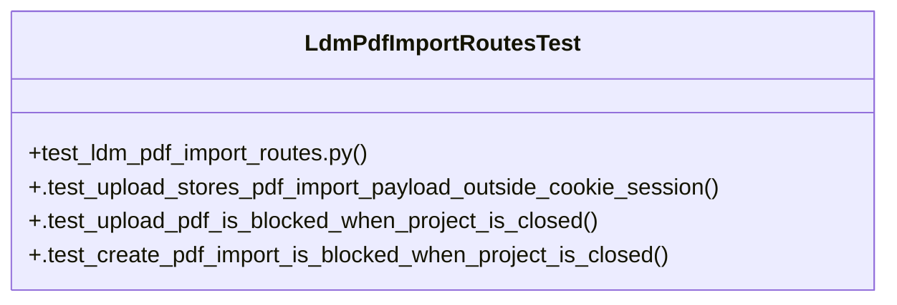

# Community 9

> 59 nodes · cohesion 0.07

## Key Concepts

- [materials.py](file:///Users/macbook/Documents/ProjectTracker/tracker/routes/materials.py#L1) (45 connections)
- [import_ldm_csv_upload()](file:///Users/macbook/Documents/ProjectTracker/tracker/routes/materials.py#L267) (15 connections)
- [hydrate_ldm()](file:///Users/macbook/Documents/ProjectTracker/tracker/catalog.py#L481) (12 connections)
- [_find_project()](file:///Users/macbook/Documents/ProjectTracker/tracker/routes/materials.py#L31) (12 connections)
- [import_ldm_pdf_create()](file:///Users/macbook/Documents/ProjectTracker/tracker/routes/materials.py#L778) (11 connections)
- [sync_ldm_bundles()](file:///Users/macbook/Documents/ProjectTracker/tracker/routes/materials.py#L444) (11 connections)
- [pdf_ldm_import.py](file:///Users/macbook/Documents/ProjectTracker/tracker/pdf_ldm_import.py#L1) (11 connections)
- [new_ldm()](file:///Users/macbook/Documents/ProjectTracker/tracker/routes/materials.py#L219) (10 connections)
- [edit_ldm()](file:///Users/macbook/Documents/ProjectTracker/tracker/routes/materials.py#L380) (9 connections)
- [import_ldm_pdf_map()](file:///Users/macbook/Documents/ProjectTracker/tracker/routes/materials.py#L750) (9 connections)
- [_bundle_suggestion_ldm()](file:///Users/macbook/Documents/ProjectTracker/tracker/routes/materials.py#L157) (8 connections)
- [extract_items_from_pdf()](file:///Users/macbook/Documents/ProjectTracker/tracker/pdf_ldm_import.py#L291) (8 connections)
- [_clear_pdf_import()](file:///Users/macbook/Documents/ProjectTracker/tracker/routes/materials.py#L655) (7 connections)
- [import_ldm_pdf_upload()](file:///Users/macbook/Documents/ProjectTracker/tracker/routes/materials.py#L693) (7 connections)
- [ldm_pdf_editor()](file:///Users/macbook/Documents/ProjectTracker/tracker/routes/materials.py#L588) (7 connections)
- [_load_pdf_import()](file:///Users/macbook/Documents/ProjectTracker/tracker/routes/materials.py#L672) (7 connections)
- [ldm_from_form()](file:///Users/macbook/ProjectTracker/tracker/form_models.py#L145) (6 connections)
- [_bundle_sync_suggestions()](file:///Users/macbook/Documents/ProjectTracker/tracker/routes/materials.py#L194) (6 connections)
- [_ldm_csv_response()](file:///Users/macbook/Documents/ProjectTracker/tracker/routes/materials.py#L122) (6 connections)
- [ldm_pdf()](file:///Users/macbook/Documents/ProjectTracker/tracker/routes/materials.py#L561) (6 connections)
- [_pdf_import_path()](file:///Users/macbook/Documents/ProjectTracker/tracker/routes/materials.py#L648) (6 connections)
- [_render_ldm_form()](file:///Users/macbook/Documents/ProjectTracker/tracker/routes/materials.py#L146) (6 connections)
- [_clean_form_text()](file:///Users/macbook/Documents/ProjectTracker/tracker/routes/materials.py#L27) (5 connections)
- [_store_pdf_import()](file:///Users/macbook/Documents/ProjectTracker/tracker/routes/materials.py#L663) (5 connections)
- [_extract_from_tables()](file:///Users/macbook/Documents/ProjectTracker/tracker/pdf_ldm_import.py#L202) (5 connections)
- *... and 34 more nodes in this community*

## Class Diagram

```mermaid
classDiagram
    class LdmPdfImportRoutesTest {
        +test_ldm_pdf_import_routes.py()
        +.test_upload_stores_pdf_import_payload_outside_cookie_session()
        +.test_upload_pdf_is_blocked_when_project_is_closed()
        +.test_create_pdf_import_is_blocked_when_project_is_closed()
    }
```

## Relationships

- [[Community 11]] (7 shared connections)

## Source Files

- [/Users/macbook/Documents/ProjectTracker/tests/test_ldm_pdf_import_routes.py](file:///Users/macbook/Documents/ProjectTracker/tests/test_ldm_pdf_import_routes.py)
- [/Users/macbook/Documents/ProjectTracker/tracker/catalog.py](file:///Users/macbook/Documents/ProjectTracker/tracker/catalog.py)
- [/Users/macbook/Documents/ProjectTracker/tracker/pdf_ldm_import.py](file:///Users/macbook/Documents/ProjectTracker/tracker/pdf_ldm_import.py)
- [/Users/macbook/Documents/ProjectTracker/tracker/routes/materials.py](file:///Users/macbook/Documents/ProjectTracker/tracker/routes/materials.py)
- [/Users/macbook/ProjectTracker/tracker/form_models.py](file:///Users/macbook/ProjectTracker/tracker/form_models.py)
- [/Users/macbook/ProjectTracker/tracker/pdf_ldm_import.py](file:///Users/macbook/ProjectTracker/tracker/pdf_ldm_import.py)
- [/Users/macbook/ProjectTracker/tracker/routes/materials.py](file:///Users/macbook/ProjectTracker/tracker/routes/materials.py)

## Audit Trail

- EXTRACTED: 237 (72%)
- INFERRED: 93 (28%)
- AMBIGUOUS: 0 (0%)

---

*Part of the graphify knowledge wiki. See [[index]] to navigate.*