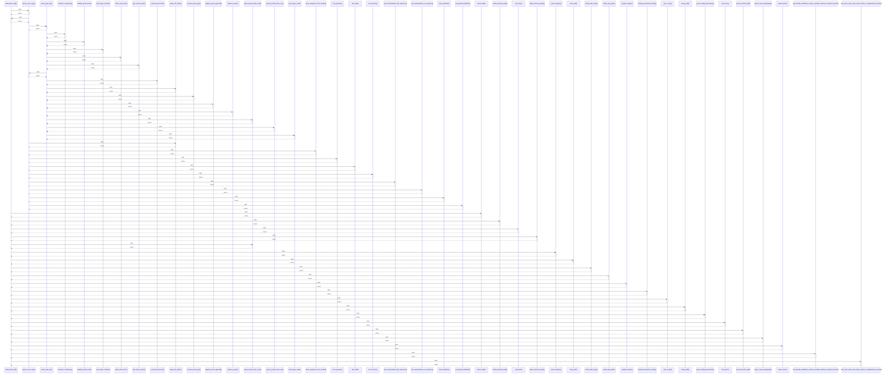

# build_quote_pdf()

> God node · 22 connections · [/Users/macbook/ProjectTracker/tracker/pdfs.py](file:///Users/macbook/ProjectTracker/tracker/pdfs.py#L234)

## Call Trace Diagram

## Connections by Relation

### calls
- [[quote_cover_copy()]] `EXTRACTED`
- [[export_data()]] `INFERRED`
- [[mobile_generate_pdf()]] `INFERRED`
- [[_safe_text()]] `EXTRACTED`
- [[quote_section_groups()]] `INFERRED`
- [[quote_project_basis_note()]] `EXTRACTED`
- [[_load_company()]] `EXTRACTED`
- [[quote_pdf()]] `INFERRED`
- [[format_date_long()]] `EXTRACTED`
- [[quote_logo_path()]] `EXTRACTED`
- [[_register_dejavu()]] `EXTRACTED`
- [[catalog_description_lookup()]] `INFERRED`
- [[_hex_to_rgb()]] `EXTRACTED`
- [[money_pdf()]] `EXTRACTED`
- [[quote_catalog_description()]] `EXTRACTED`
- [[note_lines()]] `EXTRACTED`
- [[quote_resumen_pdf()]] `INFERRED`
- [[quote_scope_paragraphs()]] `EXTRACTED`
- [[quote_terms()]] `EXTRACTED`
- [[.test_bundle_breakdown_renders_quantities_without_component_prices()]] `INFERRED`

### contains
- [[pdfs.py]] `EXTRACTED`

---

*Part of the graphify knowledge wiki. See [[index]] to navigate.*