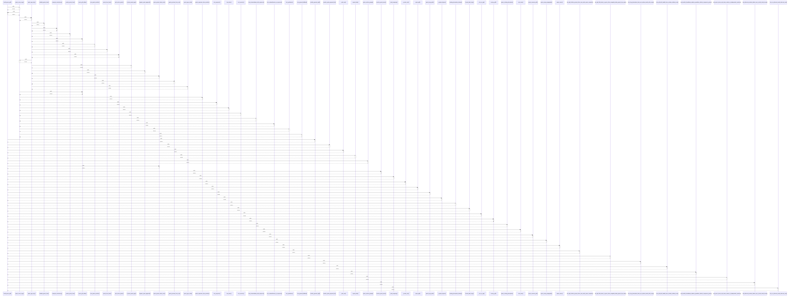

# build_quote_pdf()

> God node · 31 connections · [/Users/macbook/ProjectTracker/tracker/pdfs.py](file:///Users/macbook/ProjectTracker/tracker/pdfs.py#L252)

## Call Trace Diagram

```mermaid
sequenceDiagram
    participant P0 as build_quote_pdf()
    participant P1 as quote_cover_copy()
    participant P2 as quote_type_key()
    participant P3 as validate_quote_form()
    participant P4 as compute_consistency()
    participant P5 as _render_quote_form()
    participant P6 as quote_pdf_editor()
    participant P7 as next_quote_number()
    participant P8 as quote_from_form()
    participant P9 as pick_active_quote()
    participant P10 as is_base_quote_type()
    participant P11 as migrate_quote_approval()
    participant P12 as quote_project_basis_note()
    participant P13 as _quote_preview_from_csv()
    participant P14 as quote_type_code()
    participant P15 as quote_sequence_from_number()
    participant P16 as .test_proyecto()
    participant P17 as .test_obra()
    participant P18 as .test_servicio()
    participant P19 as .test_extraordinaria_with_sequence()
    participant P20 as .test_extraordinaria_no_sequence()
    participant P21 as .test_preliminar()
    participant P22 as .test_general_fallback()
    participant P23 as mobile_generate_pdf()
    participant P24 as resolve_quote_proposal_for()
    participant P25 as _safe_text()
    participant P26 as export_data()
    participant P27 as quote_section_groups()
    participant P28 as resolve_quote_terms()
    participant P29 as _load_company()
    participant P30 as ._render_text()
    participant P31 as quote_pdf()
    participant P32 as quote_logo_path()
    participant P33 as _register_dejavu()
    participant P34 as catalog_description_lookup()
    participant P35 as format_date_long()
    participant P36 as _hex_to_rgb()
    participant P37 as money_pdf()
    participant P38 as quote_catalog_description()
    participant P39 as note_lines()
    participant P40 as quote_resumen_pdf()
    participant P41 as quote_scope_paragraphs()
    participant P42 as quote_terms()
    participant P43 as .test_pdf_reflects_project_client_over_stale_quote_snapshot()
    participant P44 as .test_pdf_falls_back_to_quote_client_snapshot_when_project_has_none()
    participant P45 as .test_long_description_does_not_orphan_words_after_wrap()
    participant P46 as .test_pdf_with_bundle_item_renders_without_error()
    participant P47 as .test_bundle_breakdown_renders_quantities_without_component_prices()
    participant P48 as .test_specs_terms_and_notes_render_as_independent_sections()
    participant P49 as .test_discount_renders_before_tax_in_both_totals_boxes()
    participant P50 as .test_no_discount_omits_discount_row()
    P0->>+ P1: calls
    P1-->>- P0: return
    P1->>+ P0: calls
    P0-->>- P1: return
    P1->>+ P2: calls
    P2-->>- P1: return
    P2->>+ P3: calls
    P3-->>- P2: return
    P2->>+ P4: calls
    P4-->>- P2: return
    P2->>+ P5: calls
    P5-->>- P2: return
    P2->>+ P6: calls
    P6-->>- P2: return
    P2->>+ P7: calls
    P7-->>- P2: return
    P2->>+ P8: calls
    P8-->>- P2: return
    P2->>+ P9: calls
    P9-->>- P2: return
    P2->>+ P1: calls
    P1-->>- P2: return
    P2->>+ P10: calls
    P10-->>- P2: return
    P2->>+ P11: calls
    P11-->>- P2: return
    P2->>+ P12: calls
    P12-->>- P2: return
    P2->>+ P13: calls
    P13-->>- P2: return
    P2->>+ P14: calls
    P14-->>- P2: return
    P1->>+ P6: calls
    P6-->>- P1: return
    P1->>+ P15: calls
    P15-->>- P1: return
    P1->>+ P16: calls
    P16-->>- P1: return
    P1->>+ P17: calls
    P17-->>- P1: return
    P1->>+ P18: calls
    P18-->>- P1: return
    P1->>+ P19: calls
    P19-->>- P1: return
    P1->>+ P20: calls
    P20-->>- P1: return
    P1->>+ P21: calls
    P21-->>- P1: return
    P1->>+ P22: calls
    P22-->>- P1: return
    P0->>+ P23: calls
    P23-->>- P0: return
    P0->>+ P24: calls
    P24-->>- P0: return
    P0->>+ P25: calls
    P25-->>- P0: return
    P0->>+ P26: calls
    P26-->>- P0: return
    P0->>+ P27: calls
    P27-->>- P0: return
    P0->>+ P12: calls
    P12-->>- P0: return
    P0->>+ P28: calls
    P28-->>- P0: return
    P0->>+ P29: calls
    P29-->>- P0: return
    P0->>+ P30: calls
    P30-->>- P0: return
    P0->>+ P31: calls
    P31-->>- P0: return
    P0->>+ P32: calls
    P32-->>- P0: return
    P0->>+ P33: calls
    P33-->>- P0: return
    P0->>+ P34: calls
    P34-->>- P0: return
    P0->>+ P35: calls
    P35-->>- P0: return
    P0->>+ P36: calls
    P36-->>- P0: return
    P0->>+ P37: calls
    P37-->>- P0: return
    P0->>+ P38: calls
    P38-->>- P0: return
    P0->>+ P39: calls
    P39-->>- P0: return
    P0->>+ P40: calls
    P40-->>- P0: return
    P0->>+ P41: calls
    P41-->>- P0: return
    P0->>+ P42: calls
    P42-->>- P0: return
    P0->>+ P43: calls
    P43-->>- P0: return
    P0->>+ P44: calls
    P44-->>- P0: return
    P0->>+ P45: calls
    P45-->>- P0: return
    P0->>+ P46: calls
    P46-->>- P0: return
    P0->>+ P47: calls
    P47-->>- P0: return
    P0->>+ P48: calls
    P48-->>- P0: return
    P0->>+ P49: calls
    P49-->>- P0: return
    P0->>+ P50: calls
    P50-->>- P0: return
```

## Connections by Relation

### calls
- [[quote_cover_copy()]] `EXTRACTED`
- [[mobile_generate_pdf()]] `INFERRED`
- [[resolve_quote_proposal_for()]] `INFERRED`
- [[_safe_text()]] `EXTRACTED`
- [[export_data()]] `INFERRED`
- [[quote_section_groups()]] `INFERRED`
- [[quote_project_basis_note()]] `EXTRACTED`
- [[resolve_quote_terms()]] `INFERRED`
- [[_load_company()]] `EXTRACTED`
- [[._render_text()]] `INFERRED`
- [[quote_pdf()]] `INFERRED`
- [[quote_logo_path()]] `EXTRACTED`
- [[_register_dejavu()]] `EXTRACTED`
- [[catalog_description_lookup()]] `INFERRED`
- [[format_date_long()]] `EXTRACTED`
- [[_hex_to_rgb()]] `EXTRACTED`
- [[money_pdf()]] `EXTRACTED`
- [[quote_catalog_description()]] `EXTRACTED`
- [[note_lines()]] `EXTRACTED`
- [[quote_resumen_pdf()]] `INFERRED`

### contains
- [[pdfs.py]] `EXTRACTED`

---

*Part of the graphify knowledge wiki. See [[index]] to navigate.*