# catalog_maps()

> God node · 27 connections · [/Users/macbook/ProjectTracker/tracker/catalog.py](file:///Users/macbook/ProjectTracker/tracker/catalog.py#L172)

## Call Trace Diagram

```mermaid
sequenceDiagram
    participant P0 as catalog_maps()
    participant P1 as load()
    participant P2 as build_project_detail_context()
    participant P3 as today()
    participant P4 as compute_consistency()
    participant P5 as hydrate_quote()
    participant P6 as pick_active_quote()
    participant P7 as hydrate_ldm()
    participant P8 as is_base_quote_type()
    participant P9 as build_consistency_view()
    participant P10 as build_quote_row_views()
    participant P11 as build_task_row_views()
    participant P12 as build_ldm_row_views()
    participant P13 as check_blocked()
    participant P14 as project_detail()
    participant P15 as get_progress()
    participant P16 as .test_build_project_detail_context_groups_and_calculates_totals()
    participant P17 as import_ldm_csv_upload()
    participant P18 as ._get_project()
    participant P19 as _find_project()
    participant P20 as sync_ldm_bundles()
    participant P21 as import_ldm_pdf_create()
    participant P22 as add_bundle_version_route()
    participant P23 as new_ldm()
    participant P24 as bundles()
    participant P25 as export_data()
    participant P26 as new_quote()
    participant P27 as quote_pdf_editor()
    participant P28 as edit_ldm()
    participant P29 as import_ldm_pdf_map()
    participant P30 as catalogo()
    participant P31 as update_bundle_version()
    participant P32 as import_quote_csv()
    participant P33 as mobile_generate_pdf()
    participant P34 as _bundle_suggestion_ldm()
    participant P35 as proveedores()
    participant P36 as fichas()
    participant P37 as team()
    participant P38 as edit_quote()
    participant P39 as _load_company()
    participant P40 as _load_pdf_import()
    participant P41 as update_bundle()
    participant P42 as purge_deleted_item()
    participant P43 as new_project()
    participant P44 as mobile_items()
    participant P45 as main()
    participant P46 as _migrate_quote_approval()
    participant P47 as _render_ldm_form()
    participant P48 as _bundle_sync_suggestions()
    participant P49 as ldm_pdf()
    participant P50 as _render_catalogo()
    participant P51 as _render_proveedores()
    participant P52 as activate_bundle_version_route()
    participant P53 as delete_bundle_version_route()
    participant P54 as empresa_logo()
    participant P55 as purge_quote_deleted_catalog_items()
    participant P56 as update_stage_budget()
    participant P57 as _find_project()
    participant P58 as mobile_add_item()
    participant P59 as migrate_catalog_fields()
    participant P60 as migrate_catalog_disciplina()
    participant P61 as catalog_description_lookup()
    participant P62 as get_alcances()
    participant P63 as purge_ldm_deleted_catalog_items()
    participant P64 as _render_fichas()
    participant P65 as edit_catalogo()
    participant P66 as api_catalogo_add()
    participant P67 as _render_bundles()
    participant P68 as approve_quote_route()
    participant P69 as quote_pdf()
    participant P70 as quote_excel()
    participant P71 as restore_deleted_item()
    participant P72 as preserve_deleted_item()
    participant P73 as quote_resumen_excel()
    participant P74 as quote_duplicate()
    participant P75 as add_doc_checklist()
    participant P76 as .setUp()
    participant P77 as .test_update_stage_budget_skips_without_template()
    participant P78 as _csv_already_imported()
    participant P79 as ldm_csv()
    participant P80 as delete_ldm()
    participant P81 as set_ldm_cot()
    participant P82 as _render_team()
    participant P83 as delete_catalogo()
    participant P84 as migrate_catalog_marca()
    participant P85 as bulk_delete_catalogo()
    participant P86 as api_catalogo_categorias()
    participant P87 as _catalog_by_id()
    participant P88 as edit_proveedor()
    participant P89 as _find_project()
    participant P90 as view_quote()
    participant P91 as quote_resumen_pdf()
    participant P92 as quote_csv_export()
    participant P93 as audit_deleted_catalog()
    participant P94 as _find_project()
    participant P95 as update_project()
    participant P96 as update_project_status()
    participant P97 as close_project()
    participant P98 as delete_project()
    participant P99 as update_stage_status()
    participant P100 as toggle_doc_checklist()
    participant P101 as delete_doc_checklist()
    participant P102 as mobile_remove_item()
    participant P103 as mobile_review()
    participant P104 as .test_upload_stores_pdf_import_payload_outside_cookie_session()
    participant P105 as get_disciplinas()
    participant P106 as api_ldm_set_costo()
    participant P107 as bulk_edit_catalogo()
    participant P108 as api_catalogo()
    participant P109 as _catalog_sorted_by_name()
    participant P110 as delete_bundle()
    participant P111 as delete_proveedor()
    participant P112 as link_ficha()
    participant P113 as unlink_ficha()
    participant P114 as delete_ficha()
    participant P115 as delete_member()
    participant P116 as delete_quote()
    participant P117 as quote_resumen()
    participant P118 as all_quotes()
    participant P119 as dashboard()
    participant P120 as reopen_project()
    participant P121 as delete_delivery()
    participant P122 as api_catalogo_impact()
    participant P123 as mobile_projects()
    participant P124 as catalog_name_key()
    participant P125 as _quote_preview_from_csv()
    participant P126 as _build_resumen()
    participant P127 as _parse_quote_items()
    participant P128 as _parse_ldm_items()
    participant P129 as _build_quote_workbook()
    participant P130 as _ldm_csv_response()
    participant P131 as _hydrate_import_items()
    P0->>+ P1: calls
    P1-->>- P0: return
    P1->>+ P0: calls
    P0-->>- P1: return
    P1->>+ P2: calls
    P2-->>- P1: return
    P2->>+ P1: calls
    P1-->>- P2: return
    P2->>+ P3: calls
    P3-->>- P2: return
    P2->>+ P0: calls
    P0-->>- P2: return
    P2->>+ P4: calls
    P4-->>- P2: return
    P2->>+ P5: calls
    P5-->>- P2: return
    P2->>+ P6: calls
    P6-->>- P2: return
    P2->>+ P7: calls
    P7-->>- P2: return
    P2->>+ P8: calls
    P8-->>- P2: return
    P2->>+ P9: calls
    P9-->>- P2: return
    P2->>+ P10: calls
    P10-->>- P2: return
    P2->>+ P11: calls
    P11-->>- P2: return
    P2->>+ P12: calls
    P12-->>- P2: return
    P2->>+ P13: calls
    P13-->>- P2: return
    P2->>+ P14: calls
    P14-->>- P2: return
    P2->>+ P15: calls
    P15-->>- P2: return
    P2->>+ P16: calls
    P16-->>- P2: return
    P1->>+ P17: calls
    P17-->>- P1: return
    P1->>+ P18: calls
    P18-->>- P1: return
    P1->>+ P19: calls
    P19-->>- P1: return
    P1->>+ P20: calls
    P20-->>- P1: return
    P1->>+ P21: calls
    P21-->>- P1: return
    P1->>+ P22: calls
    P22-->>- P1: return
    P1->>+ P23: calls
    P23-->>- P1: return
    P1->>+ P24: calls
    P24-->>- P1: return
    P1->>+ P25: calls
    P25-->>- P1: return
    P1->>+ P26: calls
    P26-->>- P1: return
    P1->>+ P27: calls
    P27-->>- P1: return
    P1->>+ P28: calls
    P28-->>- P1: return
    P1->>+ P29: calls
    P29-->>- P1: return
    P1->>+ P30: calls
    P30-->>- P1: return
    P1->>+ P31: calls
    P31-->>- P1: return
    P1->>+ P32: calls
    P32-->>- P1: return
    P1->>+ P33: calls
    P33-->>- P1: return
    P1->>+ P34: calls
    P34-->>- P1: return
    P1->>+ P35: calls
    P35-->>- P1: return
    P1->>+ P36: calls
    P36-->>- P1: return
    P1->>+ P37: calls
    P37-->>- P1: return
    P1->>+ P38: calls
    P38-->>- P1: return
    P1->>+ P39: calls
    P39-->>- P1: return
    P1->>+ P40: calls
    P40-->>- P1: return
    P1->>+ P41: calls
    P41-->>- P1: return
    P1->>+ P42: calls
    P42-->>- P1: return
    P1->>+ P43: calls
    P43-->>- P1: return
    P1->>+ P44: calls
    P44-->>- P1: return
    P1->>+ P45: calls
    P45-->>- P1: return
    P1->>+ P46: calls
    P46-->>- P1: return
    P1->>+ P47: calls
    P47-->>- P1: return
    P1->>+ P48: calls
    P48-->>- P1: return
    P1->>+ P49: calls
    P49-->>- P1: return
    P1->>+ P50: calls
    P50-->>- P1: return
    P1->>+ P51: calls
    P51-->>- P1: return
    P1->>+ P52: calls
    P52-->>- P1: return
    P1->>+ P53: calls
    P53-->>- P1: return
    P1->>+ P54: calls
    P54-->>- P1: return
    P1->>+ P55: calls
    P55-->>- P1: return
    P1->>+ P56: calls
    P56-->>- P1: return
    P1->>+ P57: calls
    P57-->>- P1: return
    P1->>+ P58: calls
    P58-->>- P1: return
    P1->>+ P59: calls
    P59-->>- P1: return
    P1->>+ P60: calls
    P60-->>- P1: return
    P1->>+ P61: calls
    P61-->>- P1: return
    P1->>+ P62: calls
    P62-->>- P1: return
    P1->>+ P63: calls
    P63-->>- P1: return
    P1->>+ P64: calls
    P64-->>- P1: return
    P1->>+ P65: calls
    P65-->>- P1: return
    P1->>+ P66: calls
    P66-->>- P1: return
    P1->>+ P67: calls
    P67-->>- P1: return
    P1->>+ P68: calls
    P68-->>- P1: return
    P1->>+ P69: calls
    P69-->>- P1: return
    P1->>+ P70: calls
    P70-->>- P1: return
    P1->>+ P71: calls
    P71-->>- P1: return
    P1->>+ P72: calls
    P72-->>- P1: return
    P1->>+ P73: calls
    P73-->>- P1: return
    P1->>+ P74: calls
    P74-->>- P1: return
    P1->>+ P75: calls
    P75-->>- P1: return
    P1->>+ P76: calls
    P76-->>- P1: return
    P1->>+ P77: calls
    P77-->>- P1: return
    P1->>+ P78: calls
    P78-->>- P1: return
    P1->>+ P79: calls
    P79-->>- P1: return
    P1->>+ P80: calls
    P80-->>- P1: return
    P1->>+ P81: calls
    P81-->>- P1: return
    P1->>+ P82: calls
    P82-->>- P1: return
    P1->>+ P83: calls
    P83-->>- P1: return
    P1->>+ P84: calls
    P84-->>- P1: return
    P1->>+ P85: calls
    P85-->>- P1: return
    P1->>+ P86: calls
    P86-->>- P1: return
    P1->>+ P87: calls
    P87-->>- P1: return
    P1->>+ P88: calls
    P88-->>- P1: return
    P1->>+ P89: calls
    P89-->>- P1: return
    P1->>+ P90: calls
    P90-->>- P1: return
    P1->>+ P91: calls
    P91-->>- P1: return
    P1->>+ P92: calls
    P92-->>- P1: return
    P1->>+ P93: calls
    P93-->>- P1: return
    P1->>+ P94: calls
    P94-->>- P1: return
    P1->>+ P95: calls
    P95-->>- P1: return
    P1->>+ P96: calls
    P96-->>- P1: return
    P1->>+ P97: calls
    P97-->>- P1: return
    P1->>+ P98: calls
    P98-->>- P1: return
    P1->>+ P99: calls
    P99-->>- P1: return
    P1->>+ P100: calls
    P100-->>- P1: return
    P1->>+ P101: calls
    P101-->>- P1: return
    P1->>+ P102: calls
    P102-->>- P1: return
    P1->>+ P103: calls
    P103-->>- P1: return
    P1->>+ P104: calls
    P104-->>- P1: return
    P1->>+ P105: calls
    P105-->>- P1: return
    P1->>+ P15: calls
    P15-->>- P1: return
    P1->>+ P106: calls
    P106-->>- P1: return
    P1->>+ P107: calls
    P107-->>- P1: return
    P1->>+ P108: calls
    P108-->>- P1: return
    P1->>+ P109: calls
    P109-->>- P1: return
    P1->>+ P110: calls
    P110-->>- P1: return
    P1->>+ P111: calls
    P111-->>- P1: return
    P1->>+ P112: calls
    P112-->>- P1: return
    P1->>+ P113: calls
    P113-->>- P1: return
    P1->>+ P114: calls
    P114-->>- P1: return
    P1->>+ P115: calls
    P115-->>- P1: return
    P1->>+ P116: calls
    P116-->>- P1: return
    P1->>+ P117: calls
    P117-->>- P1: return
    P1->>+ P118: calls
    P118-->>- P1: return
    P1->>+ P119: calls
    P119-->>- P1: return
    P1->>+ P120: calls
    P120-->>- P1: return
    P1->>+ P121: calls
    P121-->>- P1: return
    P1->>+ P122: calls
    P122-->>- P1: return
    P1->>+ P123: calls
    P123-->>- P1: return
    P0->>+ P124: calls
    P124-->>- P0: return
    P0->>+ P2: calls
    P2-->>- P0: return
    P0->>+ P20: calls
    P20-->>- P0: return
    P0->>+ P21: calls
    P21-->>- P0: return
    P0->>+ P25: calls
    P25-->>- P0: return
    P0->>+ P27: calls
    P27-->>- P0: return
    P0->>+ P28: calls
    P28-->>- P0: return
    P0->>+ P29: calls
    P29-->>- P0: return
    P0->>+ P33: calls
    P33-->>- P0: return
    P0->>+ P34: calls
    P34-->>- P0: return
    P0->>+ P125: calls
    P125-->>- P0: return
    P0->>+ P126: calls
    P126-->>- P0: return
    P0->>+ P38: calls
    P38-->>- P0: return
    P0->>+ P127: calls
    P127-->>- P0: return
    P0->>+ P128: calls
    P128-->>- P0: return
    P0->>+ P129: calls
    P129-->>- P0: return
    P0->>+ P42: calls
    P42-->>- P0: return
    P0->>+ P130: calls
    P130-->>- P0: return
    P0->>+ P49: calls
    P49-->>- P0: return
    P0->>+ P55: calls
    P55-->>- P0: return
    P0->>+ P58: calls
    P58-->>- P0: return
    P0->>+ P69: calls
    P69-->>- P0: return
    P0->>+ P131: calls
    P131-->>- P0: return
    P0->>+ P90: calls
    P90-->>- P0: return
    P0->>+ P92: calls
    P92-->>- P0: return
```

## Connections by Relation

### calls
- [[load()]] `INFERRED`
- [[catalog_name_key()]] `EXTRACTED`
- [[build_project_detail_context()]] `INFERRED`
- [[sync_ldm_bundles()]] `INFERRED`
- [[import_ldm_pdf_create()]] `INFERRED`
- [[export_data()]] `INFERRED`
- [[quote_pdf_editor()]] `INFERRED`
- [[edit_ldm()]] `INFERRED`
- [[import_ldm_pdf_map()]] `INFERRED`
- [[mobile_generate_pdf()]] `INFERRED`
- [[_bundle_suggestion_ldm()]] `INFERRED`
- [[_quote_preview_from_csv()]] `INFERRED`
- [[_build_resumen()]] `INFERRED`
- [[edit_quote()]] `INFERRED`
- [[_parse_quote_items()]] `INFERRED`
- [[_parse_ldm_items()]] `INFERRED`
- [[_build_quote_workbook()]] `INFERRED`
- [[purge_deleted_item()]] `INFERRED`
- [[_ldm_csv_response()]] `INFERRED`
- [[ldm_pdf()]] `INFERRED`

### contains
- [[catalog.py]] `EXTRACTED`

---

*Part of the graphify knowledge wiki. See [[index]] to navigate.*