# parse_ldm_csv()

> God node · 21 connections · [/Users/macbook/ProjectTracker/tracker/csv_import.py](file:///Users/macbook/ProjectTracker/tracker/csv_import.py#L78)

## Call Trace Diagram

```mermaid
sequenceDiagram
    participant P0 as parse_ldm_csv()
    participant P1 as ._run_ldm_case()
    participant P2 as _write_ldm()
    participant P3 as .test_ldm_mixed_tubes_single_file()
    participant P4 as .test_ldm_with_metadata_proveedor_fecha()
    participant P5 as .test_ldm_galvanizado_pared_delgada_27mm()
    participant P6 as .test_ldm_galvanizado_pared_delgada_41mm()
    participant P7 as .test_ldm_galvanizado_pared_delgada_63mm()
    participant P8 as .test_ldm_galvanizado_pared_gruesa_27mm()
    participant P9 as .test_ldm_galvanizado_pared_gruesa_63mm()
    participant P10 as .test_ldm_pvc_sp_27mm()
    participant P11 as .test_ldm_pvc_sp_63mm()
    participant P12 as .test_ldm_pad_flexible_corrugado_35mm()
    participant P13 as .test_ldm_pad_flexible_corrugado_63mm()
    participant P14 as .test_ldm_metalico_flexible_35mm()
    participant P15 as .test_ldm_metalico_flexible_63mm()
    participant P16 as .test_ldm_flexible_licuatite_35mm()
    participant P17 as .test_ldm_flexible_licuatite_63mm()
    participant P18 as import_ldm_csv_upload()
    participant P19 as _clean()
    participant P20 as _build_catalog_index()
    participant P21 as _header_key()
    participant P22 as _first_value()
    participant P23 as _match_catalog()
    participant P24 as _detect_dialect()
    participant P25 as _parse_float()
    participant P26 as .test_parse_ldm_csv_returns_error_on_ansi_encoding()
    participant P27 as .test_parse_ldm_csv_reads_items_and_metadata()
    participant P28 as .test_parse_ldm_csv_accepts_spanish_headers_and_semicolon()
    participant P29 as .test_parse_ldm_csv_reports_missing_required_headers()
    participant P30 as .test_parse_ldm_csv_auto_links_catalog_item_id()
    participant P31 as .test_parse_ldm_csv_catalog_match_is_case_insensitive()
    participant P32 as .test_parse_ldm_csv_catalog_match_uses_catalog_name_key()
    participant P33 as .test_parse_ldm_csv_without_catalog_sets_empty_catalog_item_id()
    P0->>+ P1: calls
    P1-->>- P0: return
    P1->>+ P0: calls
    P0-->>- P1: return
    P1->>+ P2: calls
    P2-->>- P1: return
    P2->>+ P1: calls
    P1-->>- P2: return
    P2->>+ P3: calls
    P3-->>- P2: return
    P2->>+ P4: calls
    P4-->>- P2: return
    P1->>+ P5: calls
    P5-->>- P1: return
    P5->>+ P1: calls
    P1-->>- P5: return
    P1->>+ P6: calls
    P6-->>- P1: return
    P6->>+ P1: calls
    P1-->>- P6: return
    P1->>+ P7: calls
    P7-->>- P1: return
    P7->>+ P1: calls
    P1-->>- P7: return
    P1->>+ P8: calls
    P8-->>- P1: return
    P8->>+ P1: calls
    P1-->>- P8: return
    P1->>+ P9: calls
    P9-->>- P1: return
    P1->>+ P10: calls
    P10-->>- P1: return
    P1->>+ P11: calls
    P11-->>- P1: return
    P1->>+ P12: calls
    P12-->>- P1: return
    P1->>+ P13: calls
    P13-->>- P1: return
    P1->>+ P14: calls
    P14-->>- P1: return
    P1->>+ P15: calls
    P15-->>- P1: return
    P1->>+ P16: calls
    P16-->>- P1: return
    P1->>+ P17: calls
    P17-->>- P1: return
    P0->>+ P18: calls
    P18-->>- P0: return
    P0->>+ P19: calls
    P19-->>- P0: return
    P0->>+ P20: calls
    P20-->>- P0: return
    P0->>+ P21: calls
    P21-->>- P0: return
    P0->>+ P22: calls
    P22-->>- P0: return
    P0->>+ P23: calls
    P23-->>- P0: return
    P0->>+ P3: calls
    P3-->>- P0: return
    P0->>+ P4: calls
    P4-->>- P0: return
    P0->>+ P24: calls
    P24-->>- P0: return
    P0->>+ P25: calls
    P25-->>- P0: return
    P0->>+ P26: calls
    P26-->>- P0: return
    P0->>+ P27: calls
    P27-->>- P0: return
    P0->>+ P28: calls
    P28-->>- P0: return
    P0->>+ P29: calls
    P29-->>- P0: return
    P0->>+ P30: calls
    P30-->>- P0: return
    P0->>+ P31: calls
    P31-->>- P0: return
    P0->>+ P32: calls
    P32-->>- P0: return
    P0->>+ P33: calls
    P33-->>- P0: return
```

## Connections by Relation

### calls
- [[._run_ldm_case()]] `INFERRED`
- [[import_ldm_csv_upload()]] `INFERRED`
- [[_clean()]] `EXTRACTED`
- [[_build_catalog_index()]] `EXTRACTED`
- [[_header_key()]] `EXTRACTED`
- [[_first_value()]] `EXTRACTED`
- [[_match_catalog()]] `EXTRACTED`
- [[.test_ldm_mixed_tubes_single_file()]] `INFERRED`
- [[.test_ldm_with_metadata_proveedor_fecha()]] `INFERRED`
- [[_detect_dialect()]] `EXTRACTED`
- [[_parse_float()]] `EXTRACTED`
- [[.test_parse_ldm_csv_returns_error_on_ansi_encoding()]] `INFERRED`
- [[.test_parse_ldm_csv_reads_items_and_metadata()]] `INFERRED`
- [[.test_parse_ldm_csv_accepts_spanish_headers_and_semicolon()]] `INFERRED`
- [[.test_parse_ldm_csv_reports_missing_required_headers()]] `INFERRED`
- [[.test_parse_ldm_csv_auto_links_catalog_item_id()]] `INFERRED`
- [[.test_parse_ldm_csv_catalog_match_is_case_insensitive()]] `INFERRED`
- [[.test_parse_ldm_csv_catalog_match_uses_catalog_name_key()]] `INFERRED`
- [[.test_parse_ldm_csv_without_catalog_sets_empty_catalog_item_id()]] `INFERRED`

### contains
- [[csv_import.py]] `EXTRACTED`

### rationale_for
- [[Parse a LISP-exported material list CSV into LDM draft data.      Args:]] `EXTRACTED`

---

*Part of the graphify knowledge wiki. See [[index]] to navigate.*