# parse_quote_csv()

> God node · 24 connections · [/Users/macbook/ProjectTracker/tracker/quote_csv_import.py](file:///Users/macbook/ProjectTracker/tracker/quote_csv_import.py#L131)

## Call Trace Diagram

```mermaid
sequenceDiagram
    participant P0 as parse_quote_csv()
    participant P1 as _clean()
    participant P2 as validate_quote_form()
    participant P3 as quote_type_key()
    participant P4 as new_quote()
    participant P5 as _parse_float()
    participant P6 as edit_quote()
    participant P7 as _parse_quote_items()
    participant P8 as normalize_contact_rows()
    participant P9 as _validate_iso_date()
    participant P10 as _validate_optional_iso_date()
    participant P11 as .test_quote_ignores_default_empty_row_but_requires_real_items()
    participant P12 as .test_quote_validates_numbers_and_tax_range()
    participant P13 as .test_quote_accepts_valid_item_and_computes_subtotal()
    participant P14 as .test_quote_parses_integrantes()
    participant P15 as .test_quote_preserves_deleted_catalog_snapshot()
    participant P16 as .test_quote_assigns_items_to_section_rows()
    participant P17 as .test_quote_allows_section_without_items()
    participant P18 as parse_quote_xlsx()
    participant P19 as add_bundle_version_route()
    participant P20 as validate_ldm_form()
    participant P21 as bundles()
    participant P22 as update_bundle_version()
    participant P23 as _parse_ldm_items()
    participant P24 as update_bundle()
    participant P25 as _header_key()
    participant P26 as _metadata_value()
    participant P27 as _xlsx_metadata()
    participant P28 as _catalog_form()
    participant P29 as _proveedor_form()
    participant P30 as _parse_components()
    participant P31 as _row_value()
    participant P32 as _find_header_row()
    participant P33 as _is_blank()
    participant P34 as validate_project_form()
    participant P35 as _parse_price()
    participant P36 as _ficha_form()
    participant P37 as _team_form()
    participant P38 as catalog_name_key()
    participant P39 as ._run_cot_case()
    participant P40 as parse_quote_file()
    participant P41 as _build_catalog_index()
    participant P42 as _column_index()
    participant P43 as _match_catalog()
    participant P44 as .test_cot_with_metadata_proyecto_clave_and_quote_type()
    participant P45 as .test_cot_mixed_tubes_single_file()
    participant P46 as .test_cot_total_rounding_two_decimals()
    participant P47 as _detect_dialect()
    participant P48 as .test_parse_quote_csv_returns_error_on_ansi_encoding()
    participant P49 as ._parse_symbol_rows()
    participant P50 as .test_parse_quote_csv_reads_items_metadata_and_links_catalog()
    participant P51 as .test_parse_quote_csv_accepts_spanish_headers_semicolon_and_missing_price()
    participant P52 as .test_parse_quote_csv_accepts_metadata_before_header()
    participant P53 as .test_parse_quote_csv_reports_missing_required_headers()
    P0->>+ P1: calls
    P1-->>- P0: return
    P1->>+ P0: calls
    P0-->>- P1: return
    P1->>+ P2: calls
    P2-->>- P1: return
    P2->>+ P1: calls
    P1-->>- P2: return
    P2->>+ P3: calls
    P3-->>- P2: return
    P2->>+ P4: calls
    P4-->>- P2: return
    P2->>+ P5: calls
    P5-->>- P2: return
    P2->>+ P6: calls
    P6-->>- P2: return
    P2->>+ P7: calls
    P7-->>- P2: return
    P2->>+ P8: calls
    P8-->>- P2: return
    P2->>+ P9: calls
    P9-->>- P2: return
    P2->>+ P10: calls
    P10-->>- P2: return
    P2->>+ P11: calls
    P11-->>- P2: return
    P2->>+ P12: calls
    P12-->>- P2: return
    P2->>+ P13: calls
    P13-->>- P2: return
    P2->>+ P14: calls
    P14-->>- P2: return
    P2->>+ P15: calls
    P15-->>- P2: return
    P2->>+ P16: calls
    P16-->>- P2: return
    P2->>+ P17: calls
    P17-->>- P2: return
    P1->>+ P18: calls
    P18-->>- P1: return
    P1->>+ P19: calls
    P19-->>- P1: return
    P1->>+ P20: calls
    P20-->>- P1: return
    P1->>+ P21: calls
    P21-->>- P1: return
    P1->>+ P5: calls
    P5-->>- P1: return
    P1->>+ P22: calls
    P22-->>- P1: return
    P1->>+ P7: calls
    P7-->>- P1: return
    P1->>+ P23: calls
    P23-->>- P1: return
    P1->>+ P24: calls
    P24-->>- P1: return
    P1->>+ P25: calls
    P25-->>- P1: return
    P1->>+ P26: calls
    P26-->>- P1: return
    P1->>+ P27: calls
    P27-->>- P1: return
    P1->>+ P28: calls
    P28-->>- P1: return
    P1->>+ P29: calls
    P29-->>- P1: return
    P1->>+ P30: calls
    P30-->>- P1: return
    P1->>+ P31: calls
    P31-->>- P1: return
    P1->>+ P32: calls
    P32-->>- P1: return
    P1->>+ P33: calls
    P33-->>- P1: return
    P1->>+ P9: calls
    P9-->>- P1: return
    P1->>+ P34: calls
    P34-->>- P1: return
    P1->>+ P35: calls
    P35-->>- P1: return
    P1->>+ P36: calls
    P36-->>- P1: return
    P1->>+ P37: calls
    P37-->>- P1: return
    P1->>+ P10: calls
    P10-->>- P1: return
    P0->>+ P38: calls
    P38-->>- P0: return
    P0->>+ P39: calls
    P39-->>- P0: return
    P0->>+ P5: calls
    P5-->>- P0: return
    P0->>+ P40: calls
    P40-->>- P0: return
    P0->>+ P25: calls
    P25-->>- P0: return
    P0->>+ P26: calls
    P26-->>- P0: return
    P0->>+ P41: calls
    P41-->>- P0: return
    P0->>+ P32: calls
    P32-->>- P0: return
    P0->>+ P42: calls
    P42-->>- P0: return
    P0->>+ P31: calls
    P31-->>- P0: return
    P0->>+ P43: calls
    P43-->>- P0: return
    P0->>+ P44: calls
    P44-->>- P0: return
    P0->>+ P45: calls
    P45-->>- P0: return
    P0->>+ P46: calls
    P46-->>- P0: return
    P0->>+ P47: calls
    P47-->>- P0: return
    P0->>+ P48: calls
    P48-->>- P0: return
    P0->>+ P49: calls
    P49-->>- P0: return
    P0->>+ P50: calls
    P50-->>- P0: return
    P0->>+ P51: calls
    P51-->>- P0: return
    P0->>+ P52: calls
    P52-->>- P0: return
    P0->>+ P53: calls
    P53-->>- P0: return
```

## Connections by Relation

### calls
- [[_clean()]] `EXTRACTED`
- [[catalog_name_key()]] `INFERRED`
- [[._run_cot_case()]] `INFERRED`
- [[_parse_float()]] `EXTRACTED`
- [[parse_quote_file()]] `EXTRACTED`
- [[_header_key()]] `EXTRACTED`
- [[_metadata_value()]] `EXTRACTED`
- [[_build_catalog_index()]] `EXTRACTED`
- [[_find_header_row()]] `EXTRACTED`
- [[_column_index()]] `EXTRACTED`
- [[_row_value()]] `EXTRACTED`
- [[_match_catalog()]] `EXTRACTED`
- [[.test_cot_with_metadata_proyecto_clave_and_quote_type()]] `INFERRED`
- [[.test_cot_mixed_tubes_single_file()]] `INFERRED`
- [[.test_cot_total_rounding_two_decimals()]] `INFERRED`
- [[_detect_dialect()]] `EXTRACTED`
- [[.test_parse_quote_csv_returns_error_on_ansi_encoding()]] `INFERRED`
- [[._parse_symbol_rows()]] `INFERRED`
- [[.test_parse_quote_csv_reads_items_metadata_and_links_catalog()]] `INFERRED`
- [[.test_parse_quote_csv_accepts_spanish_headers_semicolon_and_missing_price()]] `INFERRED`

### contains
- [[quote_csv_import.py]] `EXTRACTED`

### rationale_for
- [[Parse a LISP-exported client quote CSV into quote draft data.]] `EXTRACTED`

---

*Part of the graphify knowledge wiki. See [[index]] to navigate.*